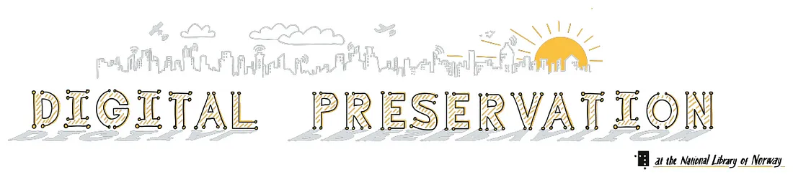

<div align="center">
  <h1>
    <a href="https://digitalpreservation-blog.nb.no/">digitalpreservation-blog.nb.no</a>
  </h1>
  <h3><b>Blog for the Digital Preservation Team at the National Library of Norway</b></h3>
  <h4>
      <a href="#links">Links</a>
      •
      <a href="#development-guide">Development Guide</a>
      •
      <a href="#deployment">Deployment</a>
      •
      <a href="#contact">Contact</a>
      •
      <a href="#copyright">Copyright</a>
  </h4>
  <h3>
    <a href="https://digitalpreservation-blog.nb.no/">
      
    </a>
  </h3>
</div>

## Introduction

This repository contains the source code for the website and blog of the Digital Preservation team at the [National Library of Norway (NLN, Nasjonalbiblioteket)](https://www.nb.no/ "National Library of Norway homepage").
The website is built using the static site generator [Hugo](https://gohugo.io/ "Hugo's homepage") and the theme [Hugo PaperMod](https://adityatelange.github.io/hugo-PaperMod/ "Hugo PaperMod's homepage").

In addition to housing blogposts written by the team, the website also contains information about the team, its members, and the projects it is involved in.
It also contains some policy documents with our principles, ambitions, goals, strategies and much more.
The website is hosted on GitHub Pages and is available at [https://digitalpreservation-blog.nb.no/](https://digitalpreservation-blog.nb.no/ "Digital Preservation team's website").

This website is designed to run in any major browser and is responsive to different screen sizes and devices.
We also try our best to make this site accessible to everyone, including people who use screen readers and other assistive technologies.
However if you notice any issues please let us know by creating an issue in this repository.

## Table of Contents <!-- omit from toc -->
1. [Introduction](#introduction)
1. [Links](#links)
1. [Development Guide](#development-guide)

## Links

As mentioned above, the website is available at [https://digitalpreservation-blog.nb.no/](https://digitalpreservation-blog.nb.no/ "Digital Preservation team's website").
The source code for the website is available at [https://github.com/NationalLibraryOfNorway/digitalpreservation-blog.nb.no](https://github.com/NationalLibraryOfNorway/digitalpreservation-blog.nb.no "Digital Preservation team's website source code").
We also have a main homepage for the National Library of Norway at [https://www.nb.no/](https://www.nb.no/ "National Library of Norway homepage").
There you can find a short introduction to the digital preservation at NLN, both in [english](https://www.nb.no/en/digital-preservation/ "English article about digital preservation at NLN"), and [norwegian](https://www.nb.no/digital-bevaring/ "Norwegian article about digital preservation at NLN").

## Development Guide

***TO BE CONTINUED...***


To preview locally. run `hugo server -D` (builds posts and drafts)
If you just had cloned the repository, you need to run `git submodule update --init --recursive` to get the theme.
If you don't have hugo installed, follow the instructions at [Hugo installation page](https://gohugo.io/installation/ "Page with guides on installing Hugo on MAC, Windows, Linux, and BSD")

See [samplepost](./content/blog/samplepost.md) for all available markdown syntax and explanations for frontmatter.

See [Content Organization](https://gohugo.io/content-management/organization/ "Documentation on how to organize content in Hugo") for a guide on how to organize content in Hugo.

Add new blog posts under content/blog directory. Organize as page bundles if using assets.

```
content
└── blog
    ├── Post1            <-- Page bundle for post 1
    │   ├── index.md     <------ post in markdown
    │   └── image1.jpeg  <------ asset used in post
    ├── Post2            <-- Page bundle for post 2
    │   └── index.md     <------ post in markdown
    │   └── image1.jpeg  <------ asset used in post
    ├── posttitle.md     <-- post 3 in markdown (w/ no assets) straight under blog directory
    └── _index.md        <-- index/layout definitions for blog overview page (do not edit)
```

Add new documents under content/documents, similarly to blog posts. These posts only show under the documents-tab.

```
content
└── documents
    ├── Document1        <-- Page bundle for document 1
    │   ├── index.md     <------ document 1 in markdown
    │   └── image1.jpeg  <------ asset used in post
    ├── Document2.md     <-- document 2 in markdown (w/ no assets) straight under blog directory
    └── _index.md        <-- index/layout definitions document overview page (do not edit)
```

