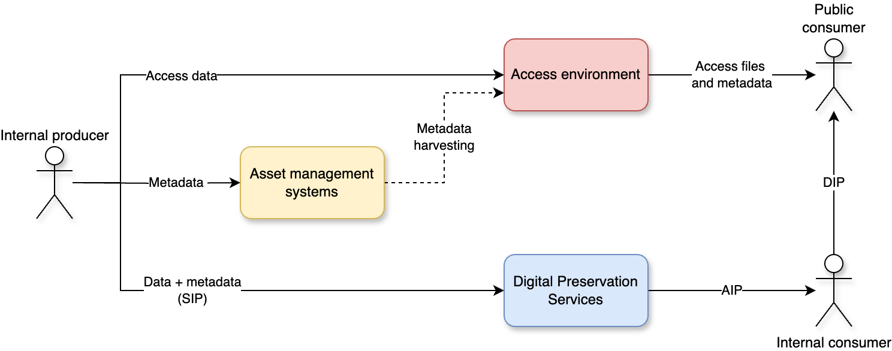

The digital preservation team uses the [OAIS model](https://en.wikipedia.org/wiki/Open_Archival_Information_System#The_functional_model "Wikipedia page explaining the OAIS functional model") as a reference point.
However, as our systems architecture is complex and has been built over several years, you can't simply overlay the OAIS drawing over our systems and make sense of it.
The digital preservation team develops and manages the Digital Preservation Services (DPS) software, but this is only one aspect of data and metadata management in the National Library.
The responsibilities for any digital object in the National Library is spread between a triad of different system domains each holding a part of the "truth":

- **Asset management systems**
	- Manages descriptive metadata
	- Holds the unique identifier for asset entities
- **Digital Preservation Services**
	- Manages preservation data
	- Has a **copy** of metadata from asset management systems
- **Public access services**
	- Manages access data
	- Has a **copy** of metadata from asset management systems

The glue that holds everything together is a unique identifier (typically a URN) shared by all systems, but managed in the asset management systems.
This needs to be unique across systems and should not be reused. 

### Asset management systems
Our asset management systems are the authoritative "truth" for descriptive metadata and assets. 
I'm using the term "asset management systems" in this text, but I could have called these "catalogs" or "metadata systems". 
Put very simply, they are systems in a wider sense that manage the metadata of assets.
In PREMIS terms the asset management systems manage intellectual entities, representations, (+ their descriptive metadata).

The asset management systems are the systems used for internal discovery.
If a user needs to find a specific asset, they should use the asset management systems.
The asset management systems holds the key unique identifier that allows for identification of access and preservation data.

### Digital Preservation Services
Our Digital Preservation Services (DPS) manages all data in our bit-repository and controls data integrity and access for long-term storage. 
It is in this environment the standardization of packages is essential. 
Along with the preserved data, we store a *copy* of select descriptive data to make the digital asset identifiable and usable in the long-term.
In PREMIS terms the Digital Preservation Services manage files and bitstreams (+ their technical metadata=.

We do not aim to replicate the metadata structures or functionality of our asset management systems in the DPS. 
The DPS is not a discovery system for descriptive metadata.
Users should already have identified the assets they are seeking before interfacing with the DPS.

### Public access services
Our public access services manages access representations of preserved data on streaming servers. 
These are typically smaller and lossy proxy files of the much larger preservation files in the DPS. 
The public access services also *harvests* select metadata from our various asset management systems, to provide public access to metadata and access copies on our webpages [NB.no](https://www.nb.no/search "National library online portal").

The public access services are our public facing discovery and access systems.
They provide access to a subset of harvested metadata from the asset management systems and related access data online.

## Architecture
This is an idealized and simplified version of our architecture, but still helpful to understand the kind of systems interactions we deal with.
While we use the OAIS framework to discuss our architecture, the various OAIS components and flows becomes quite abstract in this context[^1]. 

[^1]: You could apply the DIP concept to the public access services' dissemination of access copies, but traditionally we have only used the OAIS terminology in the digital preservation domain.

The SIP in this drawing contains data for preservation in addition to a copy of metadata from the asset management systems in a standardized format (e.g. MODS).
Our DPS is currently not exposed to the public. 
Any public access to preserved data goes through other internal services built on top of the DPS first. Access copies that can easily/automatically be derived from a preserved master file are out of principle not preserved in the DPS.

## Ramifications?
In our ongoing work with the [eArchiving standards and specification](https://dilcis.eu "Website with standards and specifications for E-ARK"), we are in the process of defining package scope, intellectual entitites to be used and representation ruleset. 
With this context it becomes clear that how we define package scope has wide-ranging concequences.
It is essential that our three environments needs to stay in sync somehow, and operate with similar concepts.
We do not want to end up in a situation where we have paralell, and possibly opposing, "truths" in different systems.

As the long term goal is to expose the DPS to 

