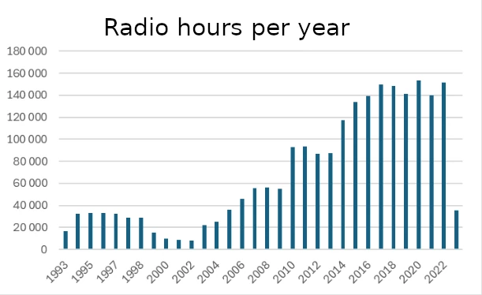

---  
title: "Rearchiving 2 million hours of digital radio, a comprehensive process"
description: "Learn how the National Library successfully migrated 2.2 million hours of digital radio archives (1 Petabyte) from a 2007 bit-repository to a modern Digital Preservation System, including the technical challenges, improvements, and lessons learned during this massive preservation project."
date: 2024-08-28  
tags: ["Digital Preservation", "Radio Archives", "Data Migration", "Digital Storage", "HPSS", "Oracle HSM", "Audio Preservation", "Broadcasting"]  
authors: 
  - name: Digital Preservation Team
    image: /apple-touch-icon.png
images: 
  - radio.jpg
---

The National Library is in the process of a major overhaul of its 2007 bit-repository, replacing it with a contemporary digital preservation system. This new solution is based on an in-house developed system called DPS (Digital Preservation Services), which uses IBM-HPSS as the underlying bit repository for data storage. This transition, which is expected to span over a couple of years, is necessary to ensure the long-term preservation and accessibility of the National Library's digital collection.

## Transition to a New Preservation Solution

In 2023, all new data archiving was transferred to the new DPS preservation solution. At this time, the old bit repository contained over 14 Petabytes of digitized and legally deposited historical material, which needs to be re-archived into DPS. A key part of this process involves analyzing and repackaging the historical data to meet the new DPS requirements.

## Historical Legally Deposited Radio

Among the materials to be re-archived are 2.2 million hours of digital radio, equivalent to 2.5 million files and a total of 1 Petabyte of data. This includes both born-digital and digitized radio programs from the period 1993-2022.

In 1993, there were four radio channels delivering 16,500 hours of radio. By 2022, the number of radio channels had increased to 30, collectively delivering 150,000 hours of radio. With the phasing out of the old bit repository, it became necessary to move this data to the new preservation solution.

## DSM to DPS: A Thorough Process

DSM (Digital Longterm Storage) has been the National Library's internal management system for legally deposited radio for the past 20 years. The data has been stored in an Oracle HSM bit-repository in three instances (disk, tape, tape), and the radio material was fetched daily from various broadcasters. Some radio broadcasts were stored as mp3 and wav files, with accompanying checksum files. Other broadcasts were only stored as mp3.

Before the re-archiving process began, it was decided to generate new MP4 playback files from the wav files to replace the varying qualities of the old mp3 files. The new MP4 files is not to be archived in DPS, as they are secured on the Wowza viewing platform. The new MP4 playback format chosen was 160kbit AAC with the M4A (audio) container. Fraunhofer FDK AAC (libfdk_aac) was used as the codec.

## Technical Improvements and Metadata

All objects were packaged according to the [E-ARK standard](https://earkaip.dilcis.eu/), and metadata was generated in MODS format. File identification was performed using the tool Siegfried, and technical metadata is extracted using [Mediainfo](https://mediaarea.net/en/MediaInfo). Each file was carefully processed and documented, and "events" were created to record what had been done. These were stored in the DPS database.

## Timeline and Experience

Preliminary studies and mapping began in the fall of 2023, and the development of the re-archiving workflow, based on Apache NiFi, started in December 2023. The first version was put into operation on February 27, 2024, and by June 24, 2024, the re-archiving of 2.2 million radio programs was completed.

The generation of new MP4 files was time-consuming, but an infrastructure running 35 parallel threads made it possible to achieve a re-archiving rate of 9 Terabytes per day.

## Findings and Lessons Learned

During the process, discrepancies were found in 577 out of 2.2 million objects. None of the errors occurred while the data was stored in the Oracle HSM bit repository. Most errors are related to inadequate control routines when the material was first received and archived.

### Checksum mismatch (4 cases)
- **Cause:** Objects failed due to a checksum mismatch, where the recorded checksum and the actual calculated checksum during re-archiving differed.
- **Action:** For each of these objects, all three copies in Oracle HSM (disk, tape, tape) were checked and found to be identical. This means the discrepancy between the actual checksum and the recorded checksum must have occurred before the object was first archived. For these four objects, we chose to include the mp3 file in the preserved object, as it had the correct checksum. Additionally, an "event" was recorded describing why we also preserved the mp3 file.

### Null-byte file (1 case)
- **Cause:** An object where the wav file was null byte, causing a checksum mismatch.
- **Action:** We checked all three copies in Oracle HSM and found they were identical. The discrepancy between the actual checksum and the recorded checksum must have occurred before the object was stored in Oracle HSM. For this object, we chose to include the mp3 file in the preserved object, as it had content and the correct checksum. An "event" was also recorded to explain why the mp3 file was preserved.

### Corrupt file (1 case)
- **Cause:** A file with the correct checksum that failed because we couldn't extract "duration" from Mediainfo, revealing that the file was corrupt.
- **Action:** We chose to archive the corrupt file in the absence of alternatives and recorded an "event" describing our findings.

### URN validation failed (507 cases)
- **Cause:** Objects with a URN that was not in the expected format. The URN validator extracts data from the URN and uses it to build MODS metadata for the object to be archived. In this case, the validator indicated that the URN content did not match what it expected. The discrepancy appears to be due to file delivery errors related to a broadcaster for a short period in October 2011.
- **Action:** URNs were changed to the correct format.

### Duplicate files (48 cases)
- **Cause:** During the re-archiving process, it was discovered that 48 objects from DSM were already archived in DPS. This is related to the transition of radio production workflows on March 21, 2023. At that time, daily legal deposit of radio was moved from DSM to the new DPS. In this process, the first datasets were manually loaded into the new DPS to ensure the transition was correct. By mistake, they were also captured by the old production workflow and archived in DSM. The data from the transition day was therefore stored in both the new DPS and the old DSM. When we started re-archiving the radio, we encountered duplicate errors for the programs from that day since they were already archived in DPS.
- **Action:** No action was needed as the data is correctly archived in DPS.

### Duplicate files (16 cases)
- **Cause:** After re-archiving was completed, there were 16 objects that, for various reasons, remained in the queue marked as not archived but were actually archived in DPS. These are mostly related to a cleanup after a backup-related incident on March 1, 2024.
- **Action:** No action was needed as the data is correctly archived in DPS.

## Statistics and Results

The re-archiving process resulted in 2.1 million new MP4 files, totalling 143 TB of new playback files on nb.no, replacing 40 TB of the old MP3 files. In total, 2,183,478 archive packages were re-archived in the new DPS preservation environment.

This work represents a significant improvement in the National Library's ability to preserve and make available digital radio material for future generations.

# Some numbers

**Statistics from DSM (old preservation environment)**

| MimeType    |  Quantity |                 Bytes | TiB |    TB |
| ----------- | --------: | --------------------: | --: | ----: |
| audio/mpeg  |    24 997 |     1 436 936 706 369 |   1 |     1 |
| audio/x-wav | 2 158 485 | 1 053 241 022 424 650 | 958 | 1 053 |
| text/plain  |   358 462 |            12 177 323 |   0 |     0 |

**Statistics from DPS (new preservation environment)**

| Type     |  Num AIPs |                 Bytes | TiB |    TB |
| -------- | --------: | --------------------: | --: | ----: |
| radio-DK |   350 929 |    47 733 509 049 163 |  43 |    48 |
| radio    | 1 832 549 | 1 007 674 770 422 690 | 916 | 1 007 |
| Total    | 2 183 478 | 1 055 408 279 471 850 | 959 | 1 055 |

*TiB (TebiByte) is bytes/1024 which is the exact unit of measurement for data volume.*

*TB(TeraByte) is bytes/1000 which is the most commonly used unit of measurement for approximate data volume.*

2.1 million new MP4 (M4a) files were produced, which together amounted to 130TiB/143TB with new access files on nb.no. This replaced approx. 40TB with old MP3 access files.

