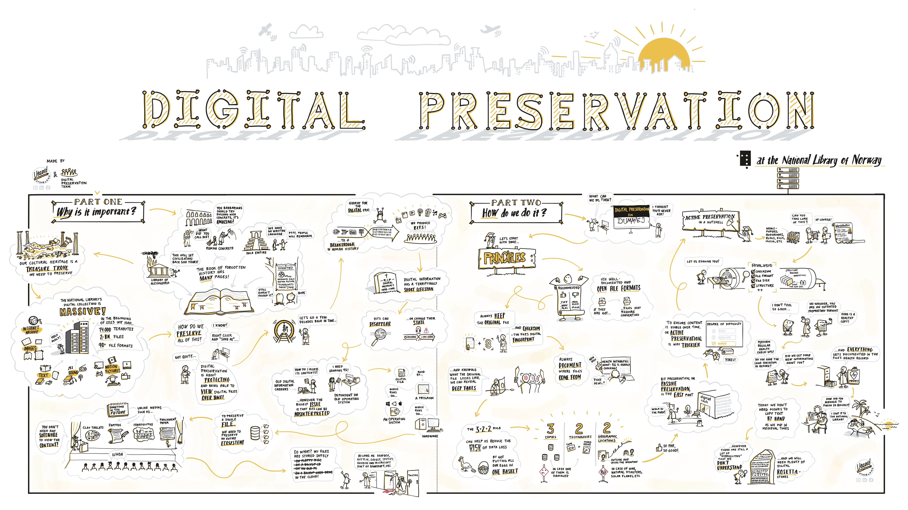

In early 2023 the digital preservation team had a poster made to spread awareness of digital preservation in the wider organization.
The poster was drawn by our former colleague [Vegard Orheim Stoveland](https://stovis.no) in colloboration with the digital preservation team.
The poster was based on the first revision of the newly defined [principles](/docs/principles/nln-digipres-principles-en/) for digital preservation in the National Library. 
The poster aimed to ilustrate why digital preservation is important, and how we intend to do it.

We hoped to share a revised version of the poster at iPRES 2024, but sadly it did not get accepted[^1].
Of course, that means we don't have to save it for IPres any longer, and can share it freely here.

[^1]:However, our poster showing our Grafana monitoring dashboards was accepted!

## English version

Full resolution PDF (16 MB) can be found [here](2023-10-04-Digital-preservation-vector.jpg). 

## Norwegian version
[")](2023-03-05-Digital-bevaring-horisontal.jpg)

Full resolution PDF (16 MB) can be found [here](2023-03-05-Digital-bevaring-horisontal.pdf). 