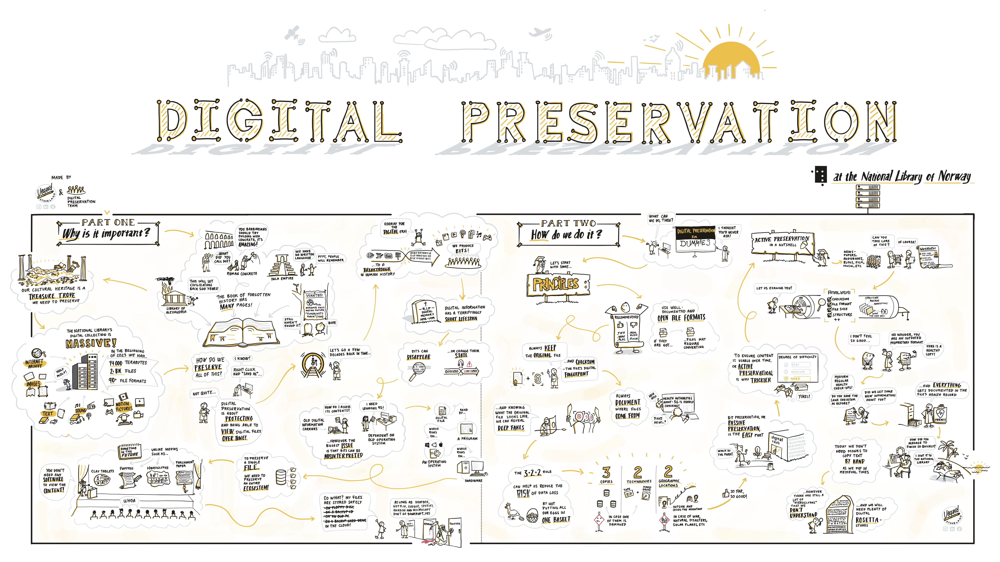

I begynnelsen av 2023 fikk teamet laget en plakat for å øke bevisstheten rundt digital bevaring i organisasjonen. I samarbeid med teamet ble plakaten illustrert av vår tidligere kollega Vegard Orheim Stoveland.
Den tar utgangspunkt i den første utgaven av [prinsippene](https://digitalpreservation.no/nb/docs/principles/) for digital bevaring ved Nasjonalbiblioteket. Målet var å visualisere hvorfor digital bevaring er viktig, og hvordan vi arbeider for å ivareta den digitale kulturarven.

Vi hadde håpet å presentere en oppdatert versjon av plakaten på iPRES 2024, men den ble dessverre ikke akseptert. [^1].
Den positive siden er at vi dermed ikke lenger trenger å spare den til konferansen – og kan dele den fritt her. 

[^1]:Plakaten vår som viser Grafana-overvåkingsdashbordene våre, ble derimot godkjent!

## Norsk versjon
[")](2023-03-05-digital-bevaring-horisontal.jpg)

PDF i full oppløsning (16 MB) kan lastes ned [her](/blog/2024-09-30-poster/2023-03-05-digital-bevaring-horisontal.pdf). 

## Engelsk versjon

PDF i full oppløsning (16 MB) kan lastes ned [her](/blog/2024-09-30-poster/2023-10-04-digital-preservation-vector.pdf). 