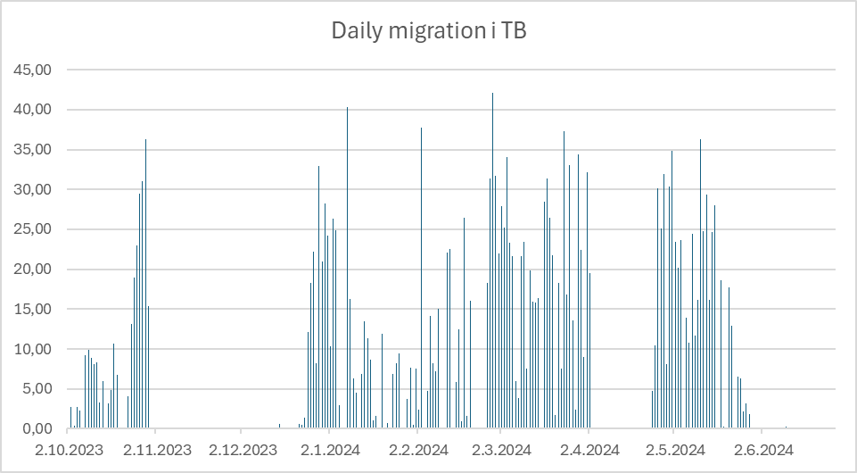
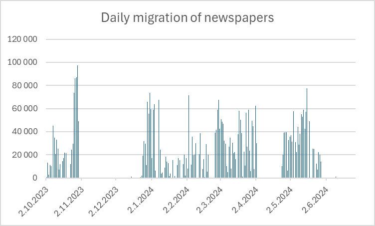

The National Library of Norway is in the process of replacing its bit-repository purchased in 2007 with a more modern preservation solution for digital material.
This solution is based on in-house developed software called DPS (Digital Preservation Services) and uses IBM-HPSS as the underlying system for data storage.

## Transition to the new preservation solution

In 2023, all archiving of data at the National Library was moved to the new DPS preservation solution.
By this time, the old bit-repository contained over 14 Petabytes[^1] of digitized and deposited historical material, which must be re-archived to DPS.
A key part of this process is analysing and repackaging the historical data to meet the requirements of the new DPS.

It was decided that the newspaper collection would be the first material type to be re-archived.
This process was carried out as a collaborative project between the Text team and the Digital Preservation team at the National Library.
The Text team is responsible for digitizing all text-based material, and the Preservation Team is responsible for preserving the digital collection.

## Brief overview of the National Library’s digital newspaper collection

- The collection consists of born-digital and digitized newspapers from 1763 up until today.
- The total newspaper collection consists of approximately 4.6 million newspapers across 1,800 newspaper titles. Of these, around 4.3 million newspapers were to be re-archived to DPS.
- In total, over 16 million packaged files had to be moved from the old bit-repository.
- This amounted to a total of approximately 2.5 Petabytes of data.

The National Library’s digital newspaper collection comes from three sources:

1.  **Legally deposited PDF newspapers.**  
    These are the print files of the newspapers, which are downloaded in PDF format. The newspapers are downloaded by the National Library from the newspaper publishers daily, then processed before being prepared for dissemination and digital preservation. As of 2024, a total of 220 published newspapers are received in this way on a daily/regular basis. This material makes up about 6% of the newspaper collection.

2.  **Newspapers scanned from microfilm.**  
    These are paper newspapers that were first photographed on microfilm and then the microfilm was digitized. The digitization was carried out by commercial companies. Most of these newspapers are published before the year 2000. This material makes up about 41% of the newspaper collection.

3.  **Newspapers scanned from paper.**  
    Original paper newspapers that have been scanned and processed internally by the National Library. This material makes up about 53% of the newspaper collection.

Newspapers can vary greatly in size and number of pages, depending on the publicised era and publication format.

For almost 20 years, the National Library has systematically digitized and received digital newspapers on a large scale. The methods for doing this have evolved over time. This means that newspapers digitized or received 20 years ago were packaged and archived differently than the newspapers being digitized today.

Here is an overview of what is done with digital/digitized newspapers that are archived today:

- Each individual page is OCR[^2] processed.
- Each individual page is going through a structure recognition process where content is analysed to recognize images, headlines, publisher information, publication date, etc. This information is stored in separate OCR/ALTO[^3] files.
- Separate JP2K (.jpx) files are created for dissemination on nb.no. This also applies to PDF-deposited newspapers.
- Separate JP2K (.jp2) files are created for long term preservation.
- A METS[^4] structure is created for all newspapers. This links the content of each newspaper so that it is possible to virtually browse through the newspaper, search its content in free text, and get highlighted search results.
- As an example: A 20-page newspaper issue can consist of about 160 individual files. These include both metadata files and content files. Typical file types are JP2K-HQ, JP2K-LQ, OCR, ALTO, METS, JHOVE, and other metadata about the newspaper object.
- All similar file types are packed together in container files of the tar[^5] type. A newspaper issue consists of a folder with .tar files.

This means that the oldest digitized newspaper material in the collection may not necessarily have been processed in the same way as today’s newspaper material.

## Improvements/decisions that impacted the re-archiving process

Before starting the re-archiving of newspapers from the old bit-repository to the new DPS, the content was analysed. Based on the analyses, several decisions were made that influenced the design of the new archival packages in DPS:

- All files that are re-archived must have accompanying checksums[^6]. Very few of the original newspaper files in SAM-FS had any checksum information.
- Internal structure cleanup of existing archival packages was to be performed. Files that were not deemed preservation-worthy would be removed from the archival packages. Examples of such files include temporary status files from the production process.
- File identification would be performed on all files. The tool DROID[^7] was used for this. DROID uses the PRONOM[^8] register as authority.
- Documentation of what was done with each file during the re-archiving process was required. This was to be done by creating specific "events" in the DPS database, based on the PREMIS[^9] standard.
- Data sent to DPS would be deleted in the old bit-repository as soon as DPS confirmed that the data was archived there.

## Timeline for the re-archiving process

{}

### March-April 2023
The two teams began with preliminary investigations and mapping of the newspaper material in the old bit-repository in the spring of 2023.

### May 2023 (migration start)
A test migration to DPS was conducted in May 2023. This revealed the need to clean up the source material in the bit-repository. A production workflow was created specifically for re-archiving newspapers to DPS.

### June-July 2023
During the summer months of 2023, the process of generating trustworthy checksums for the newspaper files started. This is described in more detail in a separate [blog post](/checksum-generation).

### October 2023
Large scale re-archiving of deposited newspapers and newspapers scanned from microfilm began in October 2023. In total, approximately 1PB of data was re-archived. The process was then halted due to delays in the delivery of new data storage resources to DPS for purchase and tendering reasons. We simply ran out of storage.

### January 2024
In January 2024, re-archiving of the newspapers scanned by the National Library began. This amounted to approximately 1.5 PB of data.

### June 2024 (migration completed)
<!-- Re-archiving of all newspapers to DPS was completed on June 1, 2024. -->

{}

#### Data volume processed over time

#### Newspaper volume processed over time

## Results and lessons learned

- The archiving speed varied considerably over time, with rates reaching 42 TB per day for simpler newspaper materials. This demonstrated HPSS's considerable ingestion capacity and helped us establish realistic timelines for future migrations. However, complex materials (like those requiring OCR reprocessing) had significantly lower throughput rates, due to additional pre-processing time.
- We experienced an unplanned pause in migration due to lack of storage media. This highlighted that large-scale migrations require comprehensive planning beyond technical considerations. Critical administrative prerequisites include active procurement agreements, completed tender processes, and streamlined purchasing procedures - all of which need significant lead time and budgetary planning.
- Old data can be messy, and migration projects present valuable opportunities for cleanup. 
    - We discovered and removed 4.5 million 0-byte files - remnants of temporary status tracking from historical digitization processes. This cleanup removes uneccessary materials and aligns our preservation packages [with our principles](/docs/principles/nln-digipres-principles-en/#ensure-that-digital-preservation-is-done-in-a-sustainable-way).
    - We cleaned up material that was incorrectly packaged or had incomplete information, ensuring that the newspaper collection is uniformly archived in DPS.
    - Poor OCR quality was identified for two years of newspaper volumes (53,678 issues, 107 TB) from 2010-2011 - the first two years of OCR processing. The files were reprocessed using the current newspaper production workflow, to produce new and improved OCR.
    - Some digitized newspapers from microfilm were of very poor quality. These were replaced with digital copies from scans of the original paper newspapers. In total, this amounted to 2,051 newspaper issues. It illustrates how original source material often produce better results than secondary generations of copies.

## Some numbers

### Overview of re-archived newspapers into DPS

| Source                 | Newspaper editions | Newspaper editions in % | Data volume in TB | Data volume in % |
| ---------------------- | ------------------ | ----------------------- | ----------------- | ---------------- |
| Born digital           | 247 385            | 6%                      | 75                | 3%               |
| Microfilm              | 1 779 043          | 41%                     | 784               | 32%              |
| Paper base             | 2 250 038          | 53%                     | 1 580             | 65%              |
| **Re-archived to DPS** | **4 276 466**      | **100%**                | **2 439**         | **100%**         |

### Overview of all newspapers in DPS (re-archived and new acquisitions since 2023)

| Source                 | Newspaper editions | Newspaper editions in % | Data volume in TB | Data volume in % |
| ---------------------- | ------------------ | ----------------------- | ----------------- | ---------------- |
| Born digital           | 302 372            | 7%                      | 87                | 3%               |
| Microfilm              | 1 899 481          | 41%                     | 820               | 31%              |
| Paper base             | 2 397 660          | 52%                     | 1 703             | 66%              |
| **Total in DPS today** | **4 599 513**      | **100%**                | **2 610**         | **100%**         |

[^1]: 1 Petabyte = 1.000 Terabyte

[^2]: https://en.wikipedia.org/wiki/Optical_character_recognition

[^3]: https://www.loc.gov/standards/alto/techcenter/elementSet/index.html

[^4]: https://www.loc.gov/standards/mets/

[^5]: https://en.wikipedia.org/wiki/Tar\_(computing)

[^6]: https://www.dpconline.org/handbook/technical-solutions-and-tools/fixity-and-checksums

[^7]: https://www.nationalarchives.gov.uk/information-management/manage-information/policy-process/digital-continuity/file-profiling-tool-droid

[^8]: https://www.nationalarchives.gov.uk/pronom/

[^9]: https://www.loc.gov/standards/premis/
