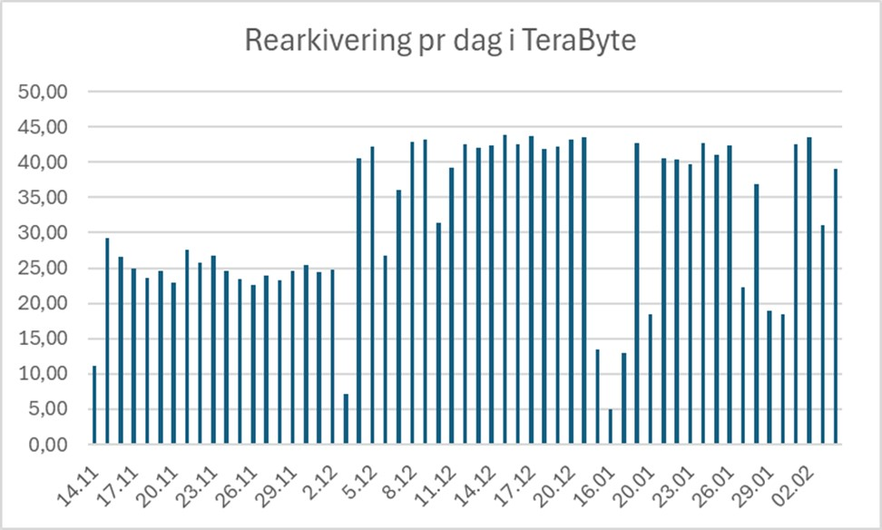

The National Library of Norway has recently completed one of its largest digital preservation projects ever: transferring the entire archive of historical digital television broadcasts to a new preservation system. Over 1.6 million hours of television, spread across as many files, were analyzed, quality assured, and repackaged—amounting to a total of 1,800 terabytes of data.

This is the story of how we did it.

## Background: One Hour, One File

Since 2007, Norwegian broadcasters have delivered television broadcasts digitally to the National Library of Norway — one MP4 file per calendar hour of TV transmission. Each file contains everything aired during one hour, regardless of where programs start or end. In practice, this means a single TV program may be spread across multiple files.

The files were stored in an older bit repository (Oracle HSM) in three copies. Now, the entire digital collection were to be rearchived into a modern preservation system — a process that imposed new requirements for quality, metadata, and packaging.

## Challenges and Decisions
✅ **Checksums for All Files**   Some broadcasters, like TV2 and TVNorge, delivered files with checksums[^1] — a digital signature confirming that the file hasn’t changed. But files from other broadcasters lacked these, so we had to generate our own checksums. 

🔠 **Standardizing File Names**   The file names contain important information — broadcaster, channel, date, and time — but many did not follow the standard format. Some lacked information about the broadcast time, others had the channel name misplaced. Before automated processing could begin, thousands of file names had to be corrected.

🔍 **Validating Technical Properties**   Each file was analyzed using the tools MediaInfo[^2] and MediaConch[^3] to validate the format. We checked that the files contained both audio and video, had the correct duration, and weren’t truncated or empty. 

📄 **Metadata and MODS**   Since none of the files had catalog data, we generated MODS[^4] metadata for each one. Information from the file names was extracted and combined with technical metadata from the analysis tools.

✏️ **Expanding Channel Names to Full Form**   In the original file names, abbreviated channel names were used, such as “BLI” for “TV2 BLISS.” These were converted into full channel names in the metadata to ensure future clarity and understanding.

📦 **Packaging Files in E-ARK Format**   All files were packaged according to the E-ARK standard[^5], a European standard for long-term preservation. We used the open-source tool Commons-ip for both packaging and validation.

📝 **Documenting Preservation Activities with PREMIS**   Changes, anomalies, and technical conditions were documented using PREMIS[^6] metadata, ensuring the entire rearchiving process is traceable and verifiable in the future. 

## Technical Solution and Progress

Work began in autumn 2024 with mapping and preparation. The actual rearchiving began in November 2024 and was completed on February 4, 2025. The process was automated using Apache NiFi[^7], which managed data processing with high control over flow and capacity.

By combining automation with targeted manual reviews, we significantly increased efficiency. Daily processing capacity rose from 25 to over 40 terabytes.

## Findings and Anomalies

With a dataset this large, some anomalies were unavoidable. Here are some examples of what we encountered: 
- **Duplicates:** Some were caused by seasonal time changes (switching to and from daylight saving time), others were identical broadcasts from different NRK districts. Files were assessed, and the best versions were kept.

- **Incorrect Checksums:** Several files arrived with invalid checksums. After closer inspection, we found that all copies were in fact identical, indicating that the error occurred prior to delivery. We updated the checksums, and the issue was documented.

- **Empty Files:** Around 30 files contained no data. In cases where it was possible, we retrieved the original files. Otherwise, the files were documented as empty with appropriate metadata. 

- **Unknown File Types:** Some MP4 files had incorrect signatures and were unrecognized by file identification tools. Some turned out to be QuickTime files in the wrong container. These were also documented. 

- **Truncated Files:** Some files were technically cut short, containing only partial content. These were preserved with documented notes on the issue. 

## What We Learned

This project showed that when preserving large volumes of data over the long term, it is critical to have robust tools, standards, and reliable control routines. It also demonstrated the importance of combining automation with professional judgment.

By using Apache NiFi for data flow and the E-ARK standard for archival packaging, we developed a scalable, reusable solution for future preservation efforts. 

## In Conclusion 

Television is a central part of our shared memory. By securing and structuring this material for the future, we enable tomorrow’s researchers, journalists, and the public to understand how Norway has evolved—hour by hour. 

[^1]: https://en.wikipedia.org/wiki/Checksum 
[^2]: https://mediaarea.net/en/MediaInfo
[^3]: https://mediaarea.net/MediaConch
[^4]: https://www.loc.gov/standards/mods/
[^5]: https://dilcis.eu/ 
[^6]: https://www.loc.gov/standards/premis/
[^7]: https://nifi.apache.org/