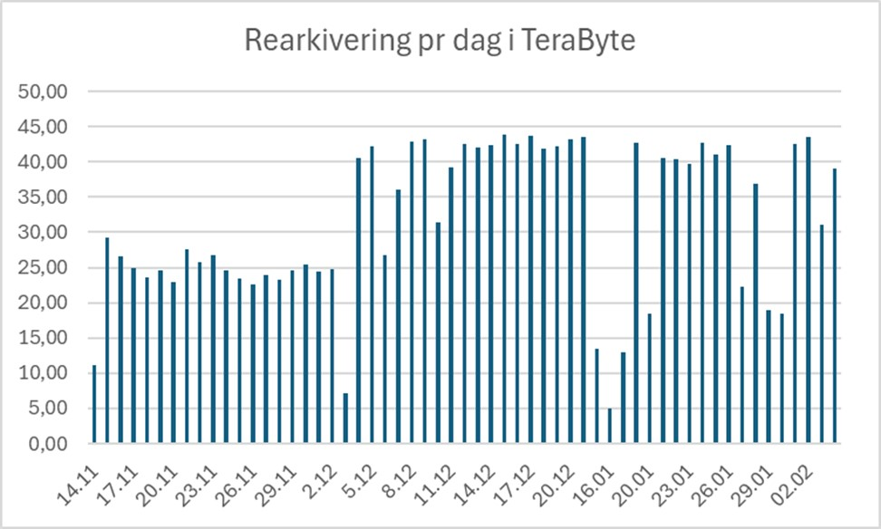

Nasjonalbiblioteket har nylig gjennomført et av sine største digitale bevaringsprosjekter noensinne: å flytte hele arkivet med historiske digitale fjernsynssendinger over til en ny bevaringsløsning. Over 1,6 millioner timer fjernsyn, fordelt på like mange filer, ble analysert, kvalitetssikret og pakket på nytt – i alt 1.800 terabyte data. 

Dette er historien om hvordan vi gjorde det. 

## Bakgrunn: En time, en fil 

Siden 2007 har norske kringkastere levert fjernsynssendinger til Nasjonalbiblioteket digitalt – én MP4-fil per kalendertime TV-sending. Hver fil inneholder altså det som ble sendt i løpet av én time, uavhengig av hvor programmer starter eller slutter. I praksis betyr det at et TV-program kan være spredt over flere filer. 

Filene har blitt lagret i et eldre bit-repositorium (Oracle HSM) i tre kopier. Nå skulle hele dette digitale materialet rearkiveres inn i et moderne bevaringssystem – en prosess som stilte nye krav til kvalitet, metadata og pakking. 

## Utfordringer og beslutninger
✅ **Sjekksummer for alle filer**   Noen kringkastere, som TV2 og TVNorge, leverte filer med sjekksummer[^1] – en digital signatur som bekrefter at filen ikke har endret seg. Men filer fra andre kringkastere manglet dette, og vi måtte derfor generere egne sjekksummer for disse. 

🔠 **Standardisering av filnavn**   Filnavnene inneholder viktig informasjon – kringkaster, kanal, dato og klokkeslett – men mange fulgte ikke standardformatet. Enkelte manglet sendetidspunkt, andre hadde kanalnavnet feilplassert. Før automatisert behandling kunne starte, måtte tusenvis av filnavn rettes. 

🔠**Tekniske kontroller**   Hver fil ble analysert med verktøyene MediaInfo[^2] og MediaConch[^3] for å validere formatet. Vi sjekket at filene hadde både lyd og bilde, korrekt varighet, og ikke var trunkert eller tomme. 

📄 **Metadata og MODS**   Siden ingen av filene hadde katalogdata, genererte vi MODS[^4]-metadata for hver enkelt. Informasjon fra filnavnet ble hentet ut og kombinert med tekniske metadata fra analyseverktøyene. 

âœï¸ **Kanalnavn - fra kortform til fullform**   I de opprinnelige filnavnene ble kun forkortede kanalnavn brukt, som “BLI†for “TV2 BLISSâ€. Dette ble konvertert til fullstendige kanalnavn i metadataene for Ã¥ sikre forstÃ¥elighet over tid. 

📦 **Pakking i E-ARK-format**   Alle filer ble pakket i henhold til E-ARK-standarden[^5], som er en europeisk standard for langtidsbevaring. Vi brukte open source-verktøyet Commons-ip til både pakking og validering. 

📠**Bevaringsaktiviteter dokumentert med PREMIS**   Endringer, avvik og teknisk tilstand ble dokumentert med PREMIS[^6]-metadata, slik at all behandling i rearkiveringsprosessen er etterprøvbar i ettertid. 

## Teknisk løsning og fremdrift

Arbeidet startet høsten 2024 med kartlegging og forberedelser. Selve rearkiveringen startet i november 2024 og ble avsluttet 4. februar 2025. Prosessen ble automatisert ved hjelp av Apache NiFi[^7], som styrte databehandlingen med høy kontroll på flyt og kapasitet. 

Ved å kombinere automatisering med målrettede manuelle vurderinger, økte vi effektiviteten betraktelig. Daglig behandlingskapasitet gikk fra 25 til over 40 terabyte.

## Funn og avvik

I et så stort datasett er det uunngåelig med avvik. Her er noen eksempler på hva vi fant blant 1,6 millioner filer: 
- **Duplikater:** Noen skyldtes klokkestilling mellom sommer- og vintertid, andre var identiske sendinger fra ulike NRK-distrikter. Filene ble vurdert og de beste versjonene beholdt. 

- **Feil sjekksummer:** Flere filer hadde feil sjekksum ved mottak. Undersøkelser viste at alle kopier var identiske – feilen oppsto altså før arkivering. Vi oppdaterte sjekksummene og dokumenterte avviket. 

- **Tomme filer:** Rundt 30 filer hadde null innhold. I tilfeller hvor originalen kunne hentes på nytt, gjorde vi det. Ellers ble filene dokumentert som tomme med tilhørende metadata. 

- **Ukjente filtyper:** Noen MP4-filer hadde feil signatur og ble ikke gjenkjent av filidentifiseringsverktøy. Noen viste seg å være QuickTime-filer i feil container. Disse ble også dokumentert. 

- **Trunkerte filer:** Enkelte filer var teknisk avkortet og inneholdt bare deler av innholdet. Disse ble bevart med informasjon om avviket. 

## Hva vi lærte 

Dette prosjektet demonstrerte hvor viktig det er å ha robuste verktøy, standarder og kontrollrutiner når store datamengder skal langtidsbevares. Det viste også hvor viktig det er å kunne kombinere automatikk med faglig skjønn. 

Ved å bruke Apache NiFi for datastrøm og E-ARK for arkivpakkene, fikk vi en skalerbar løsning som også kan brukes i fremtidige bevaringsprosjekter. 

## Til slutt 

Fjernsyn er en sentral del av vår felles hukommelse. Ved å sikre og strukturere dette materialet for framtiden, legger vi til rette for at fremtidens forskere, journalister og publikum kan forstå hvordan Norge har utviklet seg – time for time. 

[^1]: https://no.wikipedia.org/wiki/Sjekksum 
[^2]: https://mediaarea.net/en/MediaInfo
[^3]: https://mediaarea.net/MediaConch
[^4]: https://www.loc.gov/standards/mods/
[^5]: https://dilcis.eu/ 
[^6]: https://www.loc.gov/standards/premis/
[^7]: https://nifi.apache.org/
