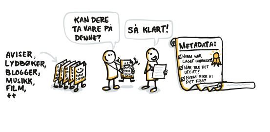

I forbindelse med [Pilot-prosjektet](/nb/blog/2025-01-28-lam-longterm-preservation-pilot/) for langtidsbevaring av museenes digitale kulturarv, har teamet jobbet med hvordan man kan standardisere avlevering av digitale objekter til Nasjonalbiblioteket for bevaring. Det er tatt utgangspunkt i bruk av [E-ark standarden](https://dilcis.eu/), og ut fra den utarbeidet mer spesifikke krav til avlevering av informasjonspakker. 

Det har i tillegg blitt sett på hvordan vi kan sikre at det avleveres et minimum med deskriptive metadata i tilknytning til objektene. Dette er i hovedsak for at dataene skal være søkbare i bevaringsomgivelsene, og ikke ment som en erstatning for avlevering av rikere metadata i pakken. Det er tatt utgangspunkt i metadatastandarden [Dublin Core](https://www.dublincore.org/specifications/dublin-core/dcmi-terms/). Standarden er enkel, feltene er åpne (ikke forhåndsdefinerte verdier), og kan derfor passe til mange ulike medietyper. 

 
 

Dokumentasjon for avleveing av SIP finnes her: [SIP 1.0](/nb/docs/dps/sip/1.0/)

Dokumentasjon om krav til avlevering av metadata finnes her: [Krav til metadata](/nb/docs/dps/api/submission/metadata/)

I første omgang er dokumentasjonen som er publisert myntet på piloten. Det er også i hovedsak tatt utgangspunkt i avlevering av medietypen bilder. Planen er å innføre samme spesifikasjoner også for interne avlevere i Nasjonalbiblioteket (produksjonsløypene våre). Oppdateringer og endringer på dokumentasjonen vil komme etter hvert som vi jobber videre utover piloten.

Ta gjerne kontakt om dere har kommentarer eller spørsmål! 👩🏻‍💻
