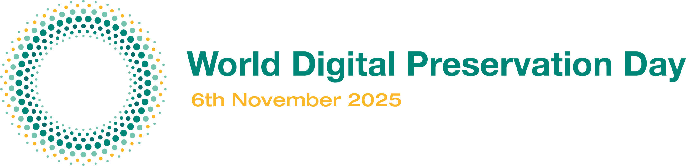

[World Digital Preservation Day](https://www.dpconline.org/events/world-digital-preservation-day) is an annual event held on the first Thursday of November. The event is organized by the [Digital Preservation Coalition](https://www.dpconline.org/) (DPC), and the day features events, campaigns, and the sharing of experiences worldwide. Its goal is to highlight both the value and the challenges of long-term preservation of digital data. This year’s theme is *Why preserve?* 

## Why digital preservation at the National Library of Norway?

The National Library of Norway’s mandate is to collect, preserve, and make accessible all published content across all types of media. This means that everything published in Norway, or published abroad about Norway, must be preserved and made available both now and in the future - whether it is physical or born-digital content. “All types of media” include, among other things, books, journals, e-books, audiobooks, posters, cards, advertisements, theatre programs, all Norwegian websites, radio broadcasts, and television programs - the list is extensive ! For this reason, the National Library is considered the most important source of knowledge about Norway and Norwegian society.

The library’s societal mission is to give the people of Norway access to our shared knowledge and cultural history. This is achieved by preserving, digitizing, and disseminating everything published for the public. Access to our cultural heritage is essential for democracy and public enlightenment, and provides a foundation for identity and historical understanding. [^1]

[^1]: National library of Norway strategy and societal mission, https://www.nb.no/om-nb/mandat-og-strategi/

**The efforts in digital preservation at the National Library are closely related to:**

- 📚 **Ensuring that today’s society, culture, and knowledge remain accessible for future generations -** Properly managed digital content lasts longer than most physical materials. Active preservation protects material from technological obsolescence, and with sufficient metadata, it can be understood far into the future.

- 🌍 **Bridging generations and geographies, making knowledge and culture accessible to everyone -** Digital content can be accessed anytime, anywhere, making sources for understanding the past and present more readily available to all.
  
- ⚖️  **Preserving digital collections to ensure compliance, accountability, and transparency across sectors -** When public institutions preserve documents, data, and communication digitally in a secure and systematic way, it enables transparency and reuse of information, makes it possible to trace decisions, actions, and resource use, and ensures that laws, regulations, and requirements are followed.
  
- 🛡️ **Protecting the integrity of our sources, research, and history -** In an era of misinformation and manipulation, preserving original documents, images, and audio recordings digitally with secure metadata standards ensures authenticity and reliability. Digital preservation allows research data, methodologies, and results to be stored in ways that can be verified and reused. Storing content in secure environments and multiple independent copies makes deliberate manipulation more difficult.

- 🌱 **Enabling sustainability, adaptability, and long-term thinking - not just storage! -** Digital preservation reduces unnecessary duplication and physical wear on archival materials while using resources efficiently over time. Digital collections can be easily integrated into new platforms, used in research, teaching, or public outreach, and adapted to future needs. In short, digital preservation is not just about storing files - it’s about building a system that keeps knowledge accessible and relevant over time, regardless of technological or organizational changes.

**Happy World Digital Preservation Day!** 🎉

