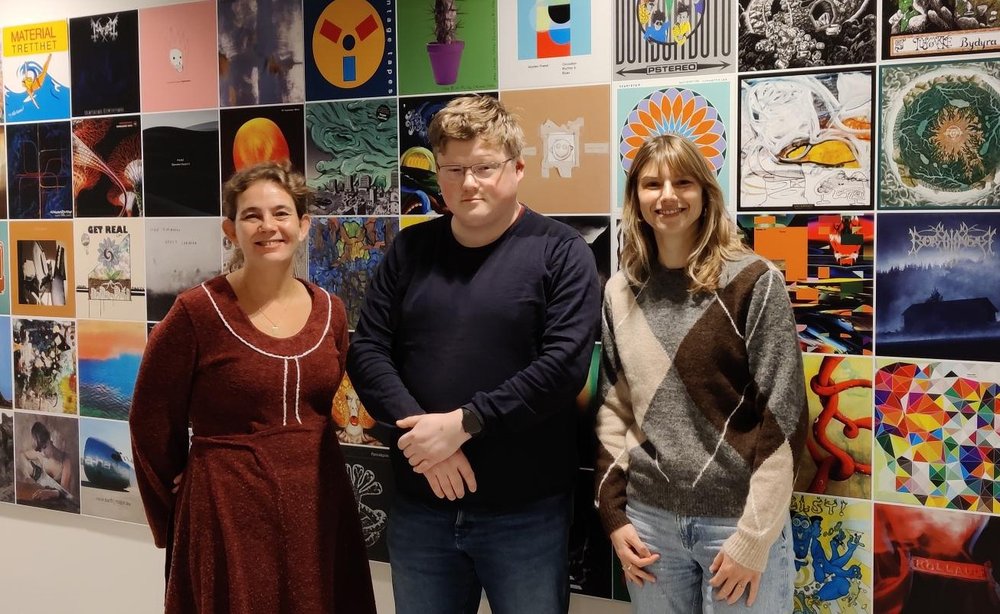

Last week, three colleagues from the Royal Library of the Netherlands (KBNL) visited the Digital Preservation Team at the National Library of Norway.

## Workshop with KBNL
Over the course of two days, we had a tightly packed program starting with a thorough tour for our guests.

While NB holds all media types and carries out extensive in-house digitisation, KBNL primarily handles text-based material, and all digitisation is carried out through tender processes in which they receive the digitised result.

After the tour, we conducted a joint workshop. The focus here was to share each institution’s experiences working with digital preservation.

NB presented the architecture of our Digital Preservation System (DPS) and its roadmap. KBNL presented their preservation solution, which is built on an internally developed system called DAPPR and uses ExLibris Rosetta and S3 for object storage (they also use ExLibris Alma). There was also a focus on experiences with metadata standards such as Dublin Core, MODS, and PREMIS. 

The final part of the workshop was devoted to discussing organisational challenges related to digital preservation work. How do we ensure that institutions maintain continuous focus and have predictable framework conditions in their digital preservation efforts so that we avoid leaving behind a period of digital darkness? Many interesting and valuable reflections emerged. We will return to this topic in a later blog post on [Digital preservation at the National Library of Norway.](https://digitalpreservation.no/)

