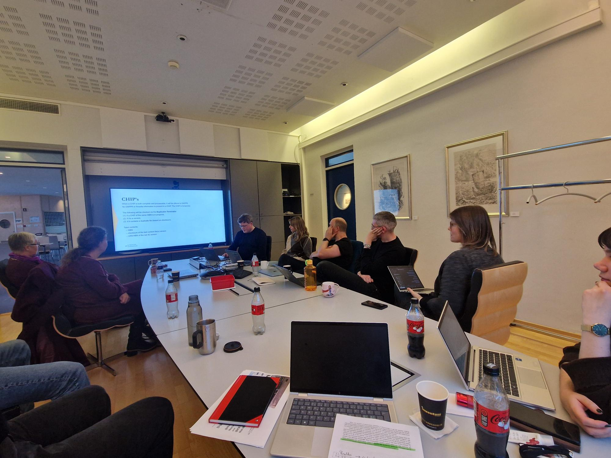

I forrige uke hadde Team Digital Bevaring i NB besøk av 3 kollegaer fra Kongelige bibliotek i Nederland (KBNL).

## Workshop med KBNL
Over to dager hadde vi et tettpakket program der vi startet med en grundig omvisning for våre gjester.

Mens NB har alle medietyper og en ganske omfattende egendigitalisering, har KBNL hovedsakelig tekstbasert materiale og all digitalisering gjøres gjennom anbudsprosesser der de mottar det digitaliserte resultatet.

Etter omvisningen gjennomførte vi en felles workshop. Fokus her var på å dele erfaringer den enkelte institusjon har fra arbeidet med digital bevaring.

NB presenterte arkitekturen for vårt DPS og veikart for dette. KBNL presenterte sin bevaringsløsning som er bygget på en internt utviklet løsning som heter DAPPR og som bruker Exlibris Rosetta og S3 for objektlagring (De bruker også Exlibris Alma). 
Det ble også fokusert på erfaringer med bruk av metadatastandarder som Dublin Core, Mods og PREMIS. 

Siste del av workshopen ble brukt til å diskutere organisatoriske utfordringer knyttet til arbeidet med digital bevaring. Hvordan sikrer vi oss at institusjonene har kontinuerlig fokus, og forutsigbare rammebetingelser i arbeidet med digital bevaring, slik at vi unngår å etterlate oss en digital informasjonsmørketid. Her kom det fram mange interessante og nyttige betraktninger. Dette vil vi komme tilbake til i en senere blogpost på [Digital Bevaring ved Nasjonalbiblioteket.](http://www.digitalbevaring.no/)

