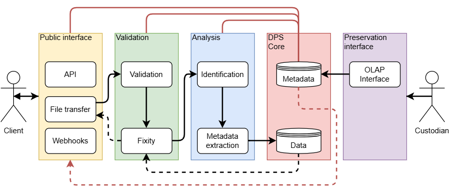

In December 2024, the National Library of Norway, the Norwegian Directorate for Cultural Heritage and KulturIT were commissioned by the Ministry of Culture and Equality to carry out a pilot project for the long-term preservation of museums’ digital material using the National Library’s Digital Preservation Service (DPS). The pilot was successfully completed, and the final report recommended further development. The Ministry subsequently commissioned the next phase of the work, and we are now underway with part two of the project.

Read more about the pilot project here: 

[Pilot Project for Long-term Digital Preservation of Museum Collections](/blog/2025-01-28-lam-longterm-preservation-pilot/)

[Mission accomplished!](/blog/2025-12-17-the-pilot-has-landed/)

The aim of the project is to establish a solution that is easy for individual museums to use, while also being able to operate at scale. The solution will enable museums to select and preserve their digital images in the most automated way possible. During the project period, up to 50 TB of data is expected to be transferred for long-term preservation. In other words, the project is about taking the next step, moving from a successful pilot to a service that can be used in practice.

The project covers the interfaces between the National Library and KulturIT, functionality for selecting and preserving images, and functionality for retrieving preserved images when needed. We will also develop documentation to support both the implementation and day-to-day use of the service.

An important part of the project is establishing the framework for the preservation process itself. This includes standardised preservation agreements between the submitting institution, the aggregator (KulturIT) and the National Library, as well as procedures for managing these agreements. Access to the service will be governed through agreements between the National Library and each individual museum.

There are also some clear boundaries to what is included in this phase. The project will not support multiple preservation agreements per museum, nor will it cover the storage of multiple types of media. For now, the focus is on the long-term preservation of museums’ digital images.

By the end of the project, we will have established standardised preservation agreements and management procedures, documentation for using the solution, and a service that is available to and in use by selected museums. The experiences and results from the project will be summarised in a report to the Ministry of Culture and Equality by 15 March 2027.

This time, KulturIT is leading the project, and we look forward to continuing the strong collaboration with our partners as we take this important development work forward.
