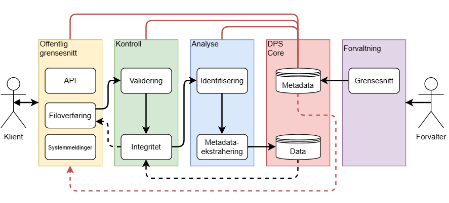

I desember 2024 fikk Nasjonalbiblioteket, Kulturdirektoratet og KulturIT i oppdrag fra Kultur- og likestillingsdepartementet å gjennomføre en pilot for langtidsbevaring av museenes digitale materiale i NBs løsning for langtidsbevaring (DPS). Pilotprosjektet ble gjennomført med suksess og rapporten anbefalte videre arbeid. Departementet bestilte videre arbeid med løsningen, og vi er nå i gang med del to av prosjektet.

Les mer om pilotprosjektet her: 

[Pilot for langtidsbevaring av museenes digitale kulturarv](/nb/blog/2025-01-28-lam-longterm-preservation-pilot/)

[Piloten har landet - Oppdrag utført!](/nb/blog/2025-12-17-the-pilot-has-landed/)

Målet med prosjektet er å få på plass en løsning som er lett å bruke for det enkelte museum, samtidig som den kan fungere i stor skala. Løsningen skal gjøre det mulig å velge ut og bevare museenes digitale bilder på en mest mulig automatisert måte. I løpet av prosjektperioden forventes det levert inntil 50 TB med data til langtidsbevaring. Med andre ord handler prosjektet om å gå fra en vellykket pilot til en tjeneste som faktisk kan brukes.

Leveranse for prosjektet dekker grensesnittet mellom Nasjonalbiblioteket og KulturIT, funksjonalitet for å velge ut og bevare bilder, og funksjonalitet for å hente tilbake bilder som er bevart. Det skal også utarbeides dokumentasjon som gjør det mulig å ta tjenesten i bruk og bruke den i praksis.

En viktig del av leveransen er også å få på plass rammene rundt selve bevaringen. Det innebærer standardiserte bevaringsavtaler mellom avleverer, aggregator (KulturIT) og Nasjonalbiblioteket, samt rutiner for forvaltning av disse. Tilgangen til tjenesten skal reguleres gjennom avtaler mellom Nasjonalbiblioteket og det enkelte museum.

Det er samtidig noen tydelige avgrensninger i denne fasen. Prosjektet vil ikke støtte flere bevaringsavtaler per museum, og omfatter heller ikke lagring av flere medietyper. I første omgang er løsningen rettet mot museenes digitale bilder.

Ved prosjektets slutt vil det være etablert standardiserte bevaringsavtaler og rutiner for forvaltning, dokumentasjon for bruk av løsningen og en tjeneste som er tilgjengelig og tatt i bruk av utvalgte museer. Erfaringene fra arbeidet skal oppsummeres i en rapport til Kultur- og likestillingsdepartementet innen 15. mars 2027.

Denne gangen er det KulturIT som leder prosjektet, og vi ser fram til å videreføre det gode samarbeidet i dette viktige utviklingsarbeidet. 
