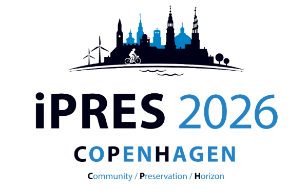
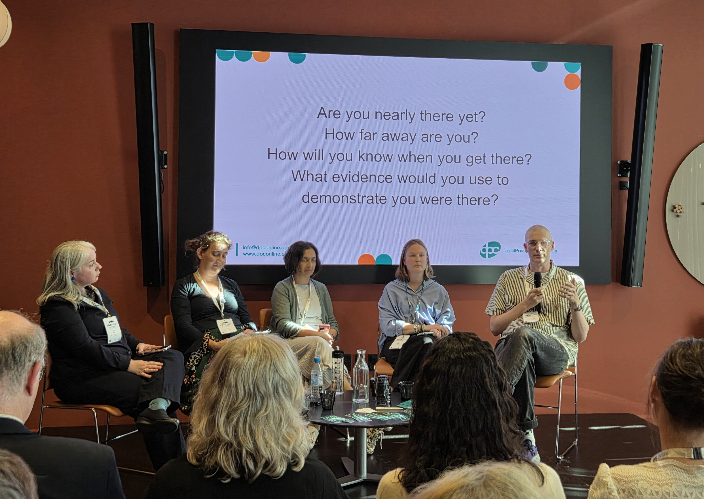
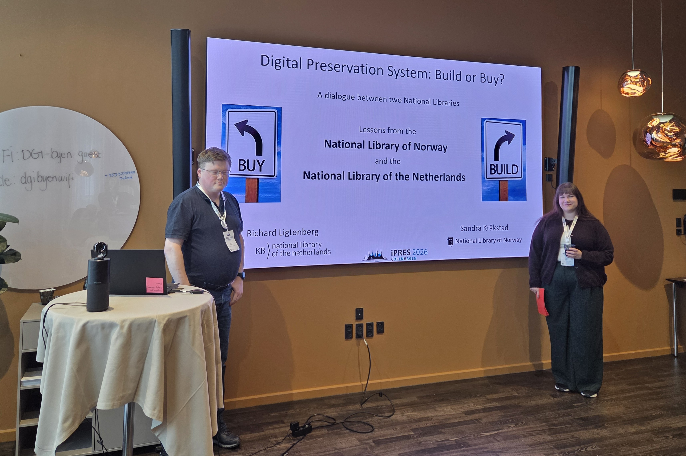
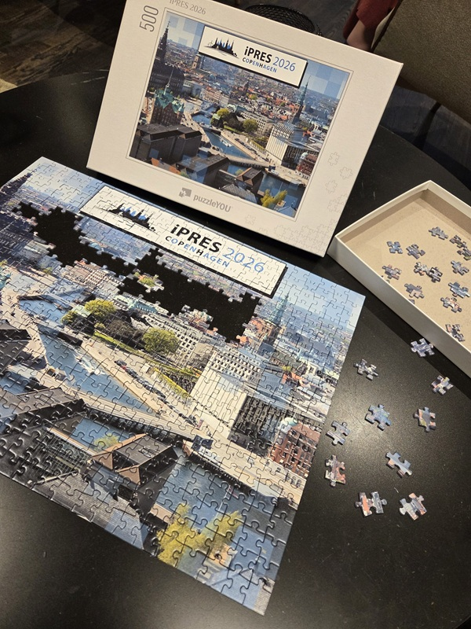
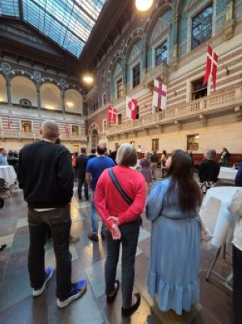

From 21 to 25 September, the Digital Preservation team attended iPRES 2026 in Copenhagen. We were represented by no fewer than six team members. This year’s conference theme was “Community, Preservation, Horizon”, a thematic reference to CPH, Copenhagen, but also a fitting summary of the broad range of work involved in digital preservation.

iPRES is one of the leading international conferences on digital preservation, bringing together professionals from libraries, archives, museums, universities and other organizations from around the world. The conference provides an opportunity to discuss challenges, exchange knowledge and explore how the field is evolving. This year, more than 600 participants from 44 countries attended.

The program covered a wide range of topics related to technology, organizational structures, workflows and strategies for digital preservation. This year’s theme highlighted the community surrounding digital preservation, the preservation work itself, and the need to look ahead. How can we collaborate and share knowledge? How do we ensure that digital materials remain accessible and usable over time? And what new challenges and opportunities do we need to prepare for?

The Digital Preservation team contributed two presentations to the conference, both built on our own experiences of establishing and operating digital preservation at the National Library of Norway.

Torbjørn Pedersen were a part of the panel discussion “Are We Nearly There Yet? Digital Preservation as Business as Usual.” 

The panel explored what happens when digital preservation moves from being a development and implementation project to becoming an integrated part of day-to-day operations. Once systems, workflows and policies are in place, how do you ensure that digital preservation actually becomes part of business as usual?
The panel brought together experiences from different organizations and discussed what “business as usual” means in different institutional contexts, and what it takes to get there. For us, this is a particularly relevant question. Digital preservation is not simply about establishing good technical solutions. It is also about developing workflows, roles and organizational structures that enable preservation to function effectively over time.

Sandra Kråkstad presented “Should I build or should I buy?... Building will give trouble, buying makes it double…”, together with Richard Ligtenberg from the National Library of the Netherlands (KBNL).

When an institution is establishing a digital preservation system, one of the first questions is often whether to build a solution in-house or purchase an existing one. Sandra and Richard drew on the experiences of the two national libraries, which have chosen different approaches. The National Library of Norway has built its own digital preservation system, while the National Library of the Netherlands has chosen to purchase and implement an existing solution (Rosetta from Clarivate). By comparing these two experiences, we wanted to show that there are different paths to establishing a functioning digital preservation system, and that both “build” and “buy” come with their own challenges and opportunities.
The aim was not to determine a winner between the two approaches, but to share experiences that may be useful to other institutions facing the same decision.

Read the paper behind the presentation here: [Should I buil or should I buy?](LigtenbergTeigen_Should_I_build_or_should_I_buy.pdf)

For us, iPRES 2026 was first and foremost an opportunity to meet other people working on many of the same challenges we face, and to gain new perspectives on how we can continue to develop digital preservation at the National Library of Norway.

The conference also provided an opportunity to make new connections and strengthen existing networks. Being able to discuss specific challenges with professionals from other institutions and countries is valuable, as is learning how they have approached and solved them. While institutions operate under different conditions and make different technical and organizational choices, many of the challenges they face are remarkably similar.

We returned home with new ideas, new contacts and confirmation that much of the work we are doing at the National Library is well aligned with international developments in the field. At the same time, the conference reminded us that digital preservation is never truly “finished”. It requires continuous development, collaboration and a willingness to keep looking towards what comes next.

