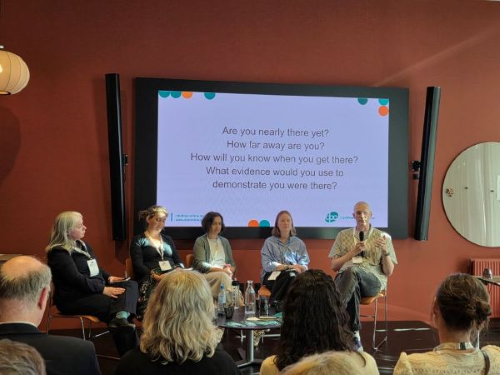
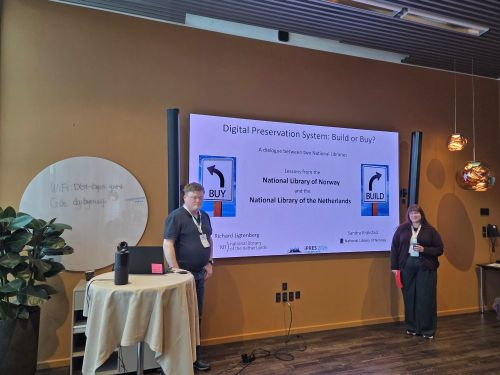

21 – 25 september deltok team Digital Bevaring på iPRES 2026 i København. Der var vi representert med hele seks teammedlemmer. Årets konferansetema var «Community, Preservation, Horizon», en tematisk referanse til CPH, København, men også en god oppsummering av bredden i arbeidet med digital bevaring.

iPRES er en av de viktigste internasjonale konferansene for digital bevaring, og samler fagfolk fra biblioteker, arkiver, museer, universiteter og andre organisasjoner fra hele verden. Konferansen er en møteplass for å diskutere utfordringer, utveksle kunnskap og se på hvordan fagfeltet utvikler seg. I år var det over 600 deltakere fra 44 land. 

Konferansen hadde et bredt program med temaer knyttet til både teknologi, organisering, arbeidsprosesser og strategier for digital bevaring. Årets tema satte søkelys på både fellesskapet rundt digital bevaring, selve bevaringsarbeidet og blikket framover. Hvordan kan vi samarbeide og dele kunnskap? Hvordan sikrer vi at digitalt materiale bevares over tid? Hvilke nye utfordringer og muligheter må vi forholde oss til framover?

Team Digital Bevaring bidro med to innlegg på konferansen, med utgangspunkt i våre egne erfaringer med å etablere og drifte digital bevaring ved Nasjonalbiblioteket.

Torbjørn Pedersen deltok i paneldebatten «Are We Nearly There Yet? Digital Preservation as Business as Usual».

Paneldebatten tok for seg hva som skjer når digital bevaring går fra å være et utviklings- og etableringsprosjekt til å bli en integrert del av den daglige virksomheten. Når systemer, arbeidsflyter og retningslinjer er på plass, hvordan sørger man for at digital bevaring faktisk blir en del av den ordinære driften? Panelet samlet erfaringer fra ulike organisasjoner og diskuterte blant annet hva «business as usual» betyr i forskjellige sammenhenger hos ulike institusjoner, og hva som skal til for å komme dit. For oss er dette en interessant problemstilling. Arbeidet handler ikke bare om å etablere gode tekniske løsninger, men også om å få på plass arbeidsprosesser, roller og organisering som gjør at bevaringen fungerer i praksis og er i stand til å tilpasse seg endringer over tid.

Sandra Kråkstad presenterte innlegget «Should I build or should I buy?... Building will give trouble, buying makes it double…», sammen med Richard Ligtenberg fra det nederlandske nasjonalbiblioteket KBNL.

Når en institusjon skal etablere et system for digital bevaring, er et av de første spørsmålene ofte om man skal bygge selv eller kjøpe en ferdig løsning. Her tok Sandra og Richard utgangspunkt i erfaringene fra de to nasjonalbibliotekene, som har valgt forskjellige tilnærminger. Nasjonalbiblioteket i Norge har bygget et eget digitalt bevaringssystem, mens KBNL har valgt å kjøpe og implementere en eksisterende løsnin (Rosetta fra Clarivate). Gjennom å sette disse to erfaringene opp mot hverandre ønsket vi å vise at det finnes ulike veier til et fungerende system for digital bevaring, og at både «build» og «buy» kommer med sine egne utfordringer og muligheter. Målet var ikke å kåre en vinner mellom de to tilnærmingene, men å dele erfaringer som kan være nyttige for andre institusjoner som står overfor det samme valget.

Her kan du lese artikkelen som ligger til grunn for presentasjonen: [Should I buil or should I buy?](LigtenbergTeigen_Should_I_build_or_should_I_buy.pdf)

 

For oss var iPRES 2026 først og fremst en anledning til å møte andre som arbeider med mange av de samme problemstillingene som oss, og få nye perspektiver på hvordan vi kan videreutvikle arbeidet med digital bevaring i Nasjonalbiblioteket.

Konferansen ga også anledning til å knytte nye kontakter og styrke eksisterende nettverk. Det er verdifullt å kunne diskutere konkrete utfordringer med fagfolk fra andre institusjoner og land, og se hvordan de har valgt å løse dem. Selv om institusjonene har ulike forutsetninger og velger ulike tekniske og organisatoriske løsninger, er mange av utfordringene de samme. 

Vi reiste hjem med både nye ideer, nye kontakter og en bekreftelse på at mye av det arbeidet vi gjør i Nasjonalbiblioteket er godt forankret i den internasjonale utviklingen av fagfeltet. Samtidig minner konferansen oss om at digital bevaring er et arbeid som aldri blir helt «ferdig», det krever kontinuerlig utvikling, samarbeid og at blikket er rettet mot det som kommer.
