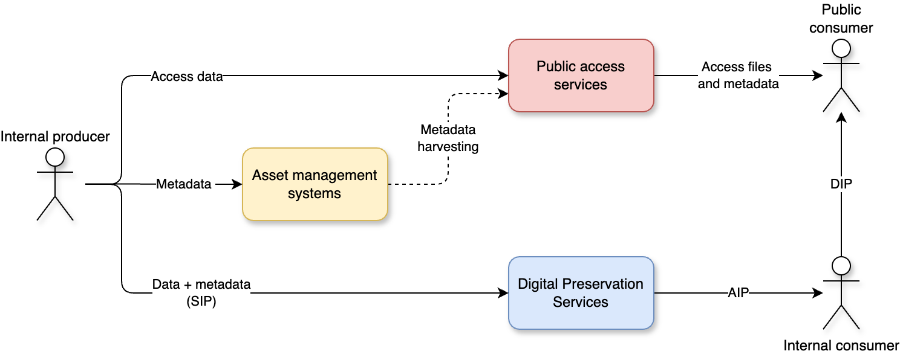
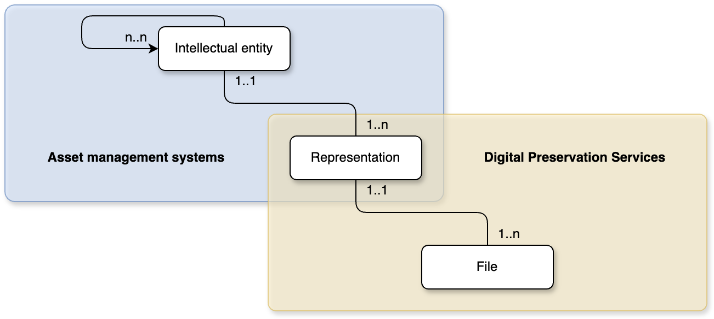

The digital preservation team uses the [OAIS model](https://en.wikipedia.org/wiki/Open_Archival_Information_System#The_functional_model "Wikipedia page explaining the OAIS functional model") as a reference point.
However, as our systems architecture is complex and has been built over several years, you can't simply overlay the OAIS drawing over our organization and make sense of it.
The digital preservation team develops and manages the Digital Preservation Services (DPS) software, but this is only one aspect of data and metadata management in the National Library.
As we contintue to develop the DPS and standardizing packages, awareness of the different systems' domains responsibilities and their interaction is essential.

The responsibilities for any digital object in the National Library is spread between a triad of different system domains each holding a part of the "truth":

- **Asset management systems**
	- Manages descriptive metadata
	- Holds the unique identifier for asset entities
- **Digital Preservation Services**
	- Manages preservation data
	- Has a **copy** of metadata from asset management systems
- **Public access services (NB.no)**
	- Manages access data
	- Has a **copy** of metadata from asset management systems

The glue that holds everything together is a unique identifier (typically a URN) shared by all systems, but managed in the asset management systems.
This needs to be unique across systems and should not be reused.

### Asset management systems
Our asset management systems are the authoritative "truth" for descriptive metadata. 
I'm using the term "asset management systems" in this text, but I could have called these "catalogs", "metadata systems" or something similar. 
Put very simply, they are systems in a wider sense that manage descriptive metadata of assets.
In PREMIS terms the asset management systems manage *intellectual entities*.
The representation level (as we interpret it), is typically not described in the asset management systems.

The asset management systems are the systems used for internal discovery in the organization [^1].
If a user needs to find an intellectual entity or representation, or their related assets, they should use the asset management systems.
The asset management systems holds the key unique identifier that allows for identification of access and preservation data.

[^1]: Some of these systems are also exposed externally.

### Digital Preservation Services
Our Digital Preservation Services (DPS) manages all data in our bit-repository and controls data integrity and access for long-term storage. 
It is in this environment the standardization of packages is essential. 
Along with the preserved data, we store a *copy* of select descriptive data to make the digital asset identifiable and usable in the long-term.
In PREMIS terms the Digital Preservation Services currently manage files [^2].

[^2]: The bitstream level is not yet described in the DPS, but it could be in the future.

The objects received for preservation in the DPS is given to us in *intellectual entity* sized chunks (SIPs).
The producer environments' owns the intellectual entity definitions, based on description levels in the relevant asset management systems.
The DPS holds the "truth" for technical *file* metadata.

We do not aim to replicate the metadata structures or functionality of our asset management systems in the DPS. 
The DPS is a discovery system for **files** (through technical metadata), but this is still a rare use-case in our organization.
Users should already have identified the intellectual entities they are seeking before interfacing with the DPS.

### Public access services (NB.no)
The public access services manages a *harvested* subset of descriptive metadata from our asset management systems and access *files*.
They disseminate this on our public facing webpages [NB.no](https://www.nb.no/search "National library online portal").
The access files are proxy copies derived from larger preserved files in the DPS. 
These are typically smaller and lossy files of the much larger preservation files in the DPS.
In PREMIS terms you could say that the public access services manage and provde access to *access representations* and *files*, in addition to harvested intellectual entity descriptive metadata[^3].

[^3]: The public access services transforms harvested metadata in a flattened structure of intellectual entities. The intellectual entities found online, does not necessarily mirror a single intellectual entity found in the asset management systems.

The public access services are our public facing discovery and access systems.
They disseminate a subset of harvested metadata from the asset management systems and related access data online.

## Architecture
This is an idealized and simplified version of our architecture, but still helpful to understand the kind of systems interactions we deal with.
While we use the OAIS framework to discuss our architecture, the various OAIS components and flows becomes quite abstract in this context[^4]. 

[^4]: You could apply the DIP concept to the public access services' dissemination of access copies, but traditionally we have only used the OAIS terminology in the digital preservation domain.

The SIP in this drawing contains data for preservation in addition to a copy of metadata from the asset management systems in a standardized format (e.g. MODS).
Our DPS is currently not exposed to the public. 
Any public access to preserved data goes through other internal services built on top of the DPS. 
Access copies that can easily/automatically be derived from a preserved master file are out of principle not preserved in the DPS.

## PREMIS
In our ongoing work with the [eArchiving standards and specification](https://dilcis.eu "Website with standards and specifications for E-ARK"), we are in the process of defining package scope, intellectual entitites to be used and representation ruleset.
These terms come from PREMIS, which again is a model mainly used in the digital preservation environment.
What becomes clear when drawing up this map is that management responsibility of the *representation* entity is quite opaque.

Responsibility of the representation level seem to fall between the cracks of different systems.
However, we still need to be able to define it's scope in terms of the E-ARK standardization, it is also a useful concept to determine overarching organziational architecture.

In the asset management system domain other metadata models are used - MARC, LRM, RDA, ISAD(G) etc.
All of these models operate with a myriad different intellectual entities, that can be mapped to PREMIS.

The representation level is an outlier here, as it is only described in the preservation packages, and not in the asset management systems. However, the intellectual entity describing the representation's *content* is defined in the asset management systems. The representation thus only exists in the DPS, but is practically defined in the asset management systems environment.

The responsibility for managing the relevant PREMIS entities are mostly clear cut, but the representation is shared.

I'm ignoring the public access environment for now, as both the data and the metadata it manages is derived from either the asset management systems or the DPS.

### Ramifications
With this context it becomes clear that how we define package scope has wide-ranging concequences.
It is essential that our three environments needs to stay in sync somehow, and operate with similar concepts.
We do not want to end up in a situation where we have paralell, and possibly opposing, "truths" in different systems.

The next text discusses intellectual entities and the representation level, attempting to define clear definitions of responsibilities for practical implementation.

