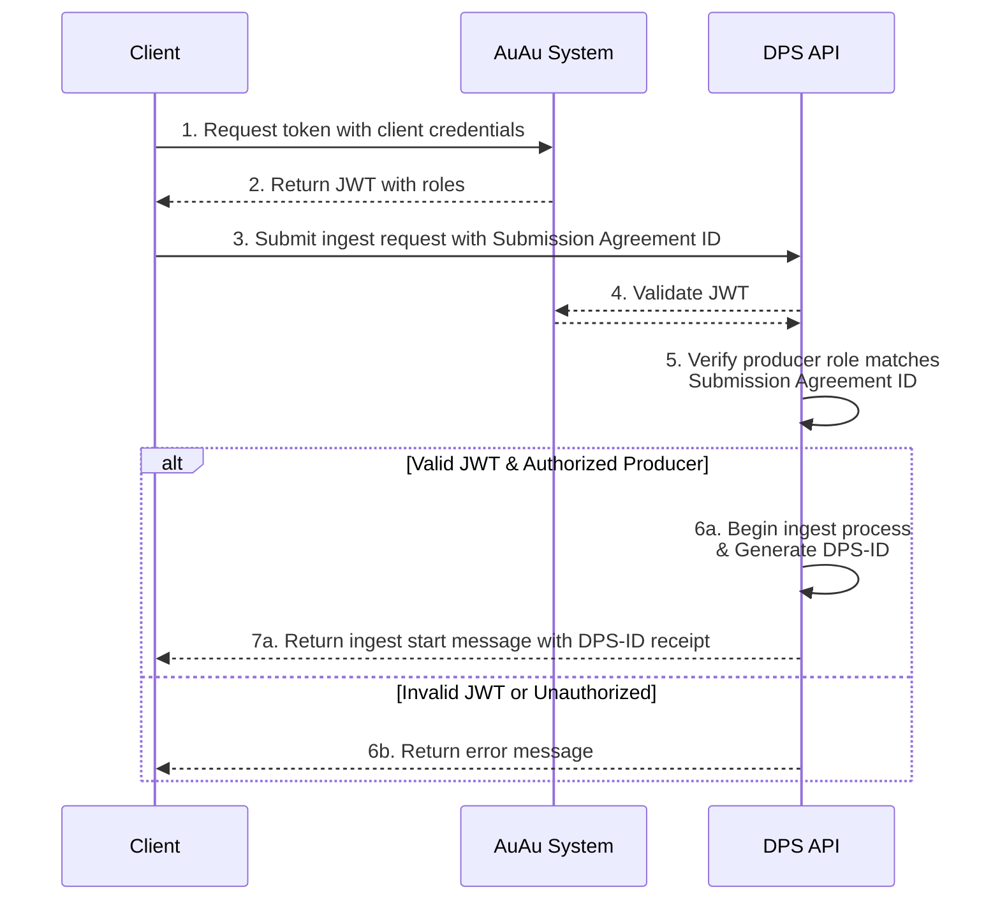
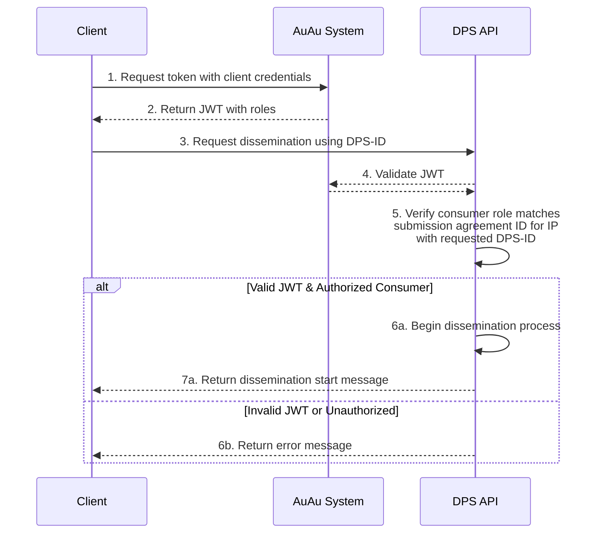
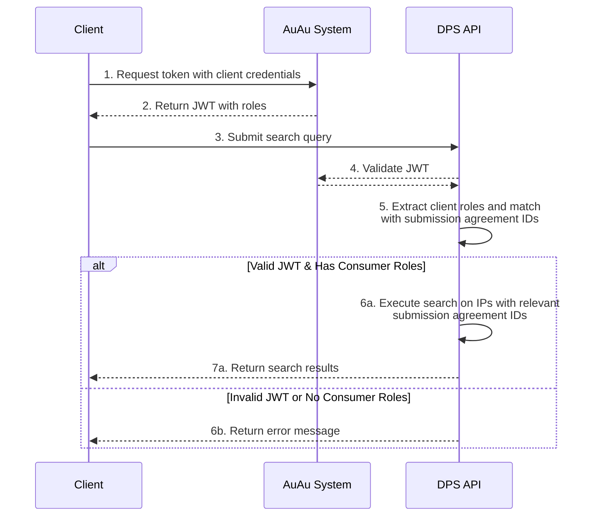

Modellen som styrer tilgang til å avlevere data til eller hente data fra DPS, har fem hovedkomponenter: *klienter*, *roller*, *bevaringsavtaler*, *informasjonspakker* og *DPS-IDer*.

### Klienter
Alle brukere som skal snakke med DPS får tildelt en klient (med en klientID) av Nasjonalbiblioteket.
Med bruker mener vi en avtalepartner (REST klient) som kan kommunisere maskinelt med DPS.
Klienter kan tildeles flere roller.

### Roller
Rollene kommer i to varianter: *produsent* og *konsument*.

En produsentrolle gir klienten rettigheter til å *levere* data til DPS i form av informasjonspakker til DPS, mens en konsumentrolle gir deg tilgang til å hente informasjonspakker ut fra DPS.
Uten en rolle kan ikke klienten interagere med DPS.

Alle enkeltroller er igjen koblet til én spesifikk bevaringsavtale.
Roller tildeles klienter av Nasjonalbiblioteket, i henhold til termene spesifisert i de enkelte bevaringsavtalene.

### Bevaringsavtaler (submission agreement)
Bevaringsavtaler sier noe om forvaltningspremissene for en gitt informasjonspakke. 
Bevaringsavtaler opprettes mellom produsenter (OAIS) og Nasjonalbiblioteket.
Bevaringsavtalen er Nasjonalbibliotekets variant av konseptet "submission agreement", som stammer fra OAIS. 
Submission agreements oppsummeres slik i E-ARK-SIP-spesifikasjonene:[^1]

> Interactions between Producers and the OAIS are often guided by a Submission Agreement, which establishes specific details about how these interactions should take place, e.g. the type of information expected to be exchanged, the metadata the Producer is expected to deliver, the logistics of the actual transfer, statements regarding access restrictions on the submitted material, etc.

I konteksten rollebasert tilgang, er det ikke detaljene i disse bevaringsavtalene som er viktig, men det at bevaringsavtalene er opprettet i systemene våre.

Produsent-/konsument-roller relatert til bevaringsavtalen opprettes i systemene våre.
En bevaringsavtale må eksistere *før* avlevering av informasjonspakker til DPS kan skje.

Bevaringsavtaler er knyttet til én eller flere informasjonspakker.

### Informasjonspakker
Når data eller metadata skal leveres til eller hentes ut fra DPS, gjøres dette i form av informasjonspakker[^2].
Individuelle informasjonspakker er knyttet til én (og kun én) bevaringsavtale.

### DPS-ID
DPS oppretter en DPS-ID for alle informasjonspakker som mottas.
DPS-ID-en er unik innenfor våre systemer.
DPS-ID-en utleveres til den som har avlevert informasjonspakken, når pakken avleveres.



### Eksempel: Innlevering av informasjonspakker
En klient som skal levere en informasjonspakke til DPS, er nødt til å spesifisere hvilken bevaringsavtale som skal gjelde for pakka.
Man kan kun levere informasjonspakker knyttet til bevaringsavtaler man er autorisert til å *produsere*.
Hvis man har de riktige rollene, vil DPS gi informasjonspakka en DPS-ID, sende DPS-ID som kvittering til klienten og starte innmatingsprosessen.

### Eksempel: Uthenting av informasjonspakker
En klient som vil hente denne informasjonspakka ut igjen, vil måtte spesifisere hvilken informasjonspakka som skal hentes ut ut ved hjelp av DPS-ID.
Hvis klienten har en konsumentrolle knyttet til bevaringsavtalen som gjelder for den relevante informasjonspakka, vil DPS starte utleveringsprosessen.

### Eksempel: Søk
En klient som vil gjøre oppslag i DPS, vil kunne gjøre oppslag på alle informasjonspakker koblet til bevaringsavtalene vedkommende har en konsumentrolle for.

[^1]: [E-ARK SIP: 4.1. Submission Agreements](https://earksip.dilcis.eu/#submissionagreements)
[^2]: For mer informasjon om informasjonspakker se [OAIS-modellen](/nb/oais).
