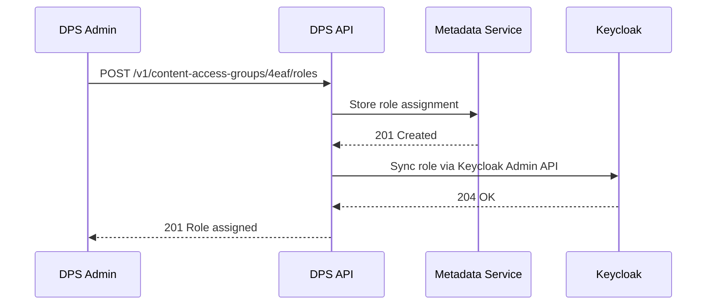
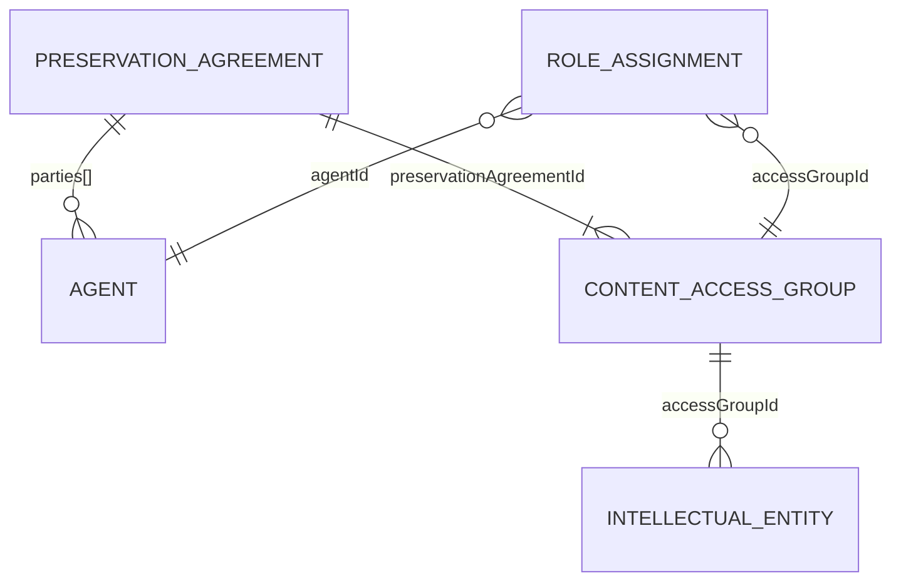

This page is a working draft describing the target architecture for agreements and role management in the DPS. It captures design decisions and open questions as the model evolves.

## The two-layer agreement model

The DPS models agreements at two levels, both based on the PREMIS Rights entity.

### Preservation Agreement (layer 1)

The Preservation Agreement represents the organizational relationship between the National Library and a client organization. It mirrors a signed contract. The actual document lives in the National Library's document archive systems; the DPS holds a full representation so that it remains self-contained regardless of external systems.

In PREMIS terms, a Preservation Agreement is a `rightsStatement` with a stored `rightsBasis`. The common case is `rightsBasis=other` (a contractual deposit agreement); `license` and `statute` are supported for agreements whose legal basis requires them. The `rightsInformation` block holds the terms and dates; PREMIS structural fields are reconstructed during export.

Each Preservation Agreement links to at least two PREMIS Agents: the client organization (role: depositor) and the National Library (role: custodian). These are the signatories. The signatory agents are distinct from the API client agents that interact with the DPS operationally. Role labels may vary by `rightsBasis` and will be refined as that work progresses.

### Content access group (layer 2)

> [!NOTE]
> **Terminology change (draft).** "Content access group" replaces the current term "submission agreement." The `contractId` field is renamed to `accessGroupId`; the 4-character hex values are unchanged. The production API still uses `/contracts/`; the path rename is an open question.

A Content access group is a functional entity within the DPS that controls access. One Preservation Agreement can have many Content access groups. This is what the current `contractId` (4-character hex identifier) refers to.

In PREMIS terms, a Content access group is a `rightsStatement` with `rightsBasis=other` and `otherRightsBasis=contentAccessGroup`. PREMIS `rightsGranted` is not stored on the document; it is decomposed into [role assignments](#role-assignments). Each active role assignment becomes a `rightsGranted` entry on export: the `role` determines the permitted `act` (drawn from the [LoC eventType vocabulary](https://id.loc.gov/vocabulary/preservation/eventType), which replaces the deprecated `actionsGranted` list), and the assignment's `startDate`/`endDate` map to `termOfGrant`. Candidate mappings: `producer`→ingestion/metadata modification, `consumer`→dissemination/exporting. The exact mapping is deferred to implementation.

Each Intellectual Entity is linked to exactly one Content access group via `accessGroupId`. The parent Preservation Agreement is always reachable through the Content access group's immutable `preservationAgreementId` field.

### Relationship between the layers

| Aspect | Preservation Agreement (layer 1) | Content access group (layer 2) |
|---|---|---|
| Nature | Organizational, legal | Functional, technical |
| Lifecycle | Signed once, rarely changes | Created as needed under a Preservation Agreement |
| PREMIS basis | `rightsBasis` stored per agreement (`other` default; `license`, `statute` supported) | `rightsBasis=other` |
| Identifies | Who can have content access groups | Which IEs, which roles, which access |
| Cardinality | One or more per client | Many per Preservation Agreement |
| `rightsGranted` | Could carry preservation-level rights (migrate, replicate, delete) | Decomposed into role assignments (submit, access) |
| Current equivalent | Does not exist in DPS | `contractId` (with no attributes; renamed to `accessGroupId` in the target model) |

### Immutability rules

- The `preservationAgreementId` on a Content access group is set at creation and cannot be changed. A content access group cannot move between preservation agreements.
- If an IE needs to move between contracts, new content access groups must exist (or be created) under the target preservation agreement. The IE's `accessGroupId` is updated, and the change is documented as a PREMIS event.

> [!NOTE]
> **Open question: direct IE-to-preservation-agreement link.** The IE reaches its preservation agreement only transitively through the content access group. A direct `preservationAgreementId` on the IE may be needed for PREMIS export (which allows multiple `linkingRightsStatementIdentifier` values) and for agreement-level queries. See [DPS core data model](/docs/dps/data-model/).

## Clients as Agents

API clients are modeled as PREMIS Agents in the preservation metadata database. This gives them identity, metadata, event attribution, and connects them to the content access groups they can access.

The signatory on a Preservation Agreement (an organization agent) and the API clients (software agents) that interact with the DPS are separate agents. A single organization may have multiple software agents with different roles on different content access groups.

Agents from different organizations can hold roles on the same content access group. For example, a regional archive submits content (producer), while a university library retrieves it (consumer), both under the same content access group.

### Agent types

| Agent type | agentType | Example | Purpose |
|---|---|---|---|
| Client system | `software` | `regional-archive-prod` | API credentials, holds role assignments |
| Client organization | `organization` | `Regional Archive` | Signs Preservation Agreements, signatory relationship |
| DPS software | `software` | `DROID 6.7.0` | Preservation tool, event attribution |

### Cross-organization access example

```
Preservation Agreement 1 (NLN <-> Regional Archive)
  Parties:
    Regional Archive (organization, depositor)
    NLN (organization, custodian)

  Content access group CAG1 (accessGroupId: 4eaf)
    Roles:
      regional-archive-prod (software) -> producer
      regional-archive-read (software) -> consumer
      university-research (software) -> consumer
        (granted by NLN per agreement terms)

Preservation Agreement 2 (NLN <-> University)
  Parties:
    University Library (organization, depositor)
    NLN (organization, custodian)

  Content access group CAG2 (accessGroupId: 2d17)
    Roles:
      university-research (software) -> producer
```

In this example, `university-research` (a single software agent) is a consumer on CAG1 and a producer on CAG2. Agents cross agreement boundaries.

## Role assignments

Roles link Agents to Content access groups. A role assignment is a PREMIS `linkingAgentIdentifier` on the Content access group's `rightsStatement`, with a `linkingAgentRole` of `producer` or `consumer`.

Role assignments are stored in their own MongoDB collection, separate from the content access group document. This separation keeps the content access group document stable when roles change.

Role assignments are immutable except for revocation:

- Each assignment has a `startDate` and an optional `endDate`
- The core fields (`agentId`, `accessGroupId`, `role`, `startDate`) are immutable after creation
- Revoking a role sets `endDate` once; once set, it cannot be changed. To re-grant a revoked role, create a new assignment document.
- The document is never deleted
- The content access group document is not modified when roles change

This creates an authorization audit trail: who was permitted to do what, and when. This complements the existing object-level audit trail (PREMIS events documenting what actually happened to each IE and file).

On PREMIS export, active role assignments for a content access group are collected and reconstructed as `rightsGranted` entries on the `rightsStatement`. Each entry carries an `act` (eventType vocabulary), a `termOfGrant` from the assignment's temporal fields, and a `linkingAgentIdentifier` referencing the agent. This separates the storage model (individual assignments with audit trail) from the PREMIS exchange model (aggregated rights on the statement).

The events collection is reserved for preservation events on objects (using the [LoC preservation event vocabulary](https://id.loc.gov/vocabulary/preservation/eventType)). Role management is an administrative concern and is tracked separately through the roleAssignments collection.

> [!NOTE]
> **Alternative: separate audit log.** Instead of temporal tracking in roleAssignments, role assignments could be simplified to current state only (created on grant, deleted on revocation), with a separate `auditLog` collection recording administrative actions.
>
> The auditLog would be a generic, append-only collection for documenting administrative actions across the DPS: role grants and revocations, agreement creation and modification, agent registration, Keycloak sync operations, and IE contract changes. Each entry records an action, timestamp, who performed it, what was acted upon, and the outcome.
>
> This separates administrative events (what happened to the DPS system) from preservation events (what happened to preserved objects), keeping both collections focused. The trade-off is an additional collection to maintain.

### DPS as source of truth

The DPS is the authoritative source for role assignments. Changes made through the DPS API are synced to the IAM system (Keycloak) via its Admin API. Keycloak handles authentication and token issuance only. The runtime auth flow (JWT validation) is unchanged.



## Data model

### Entity-relationship diagram



For the complete data model, see [DPS core data model](/docs/dps/data-model/).

### MongoDB documents

#### Collection: preservationAgreements

The `identifiers[]` array references the agreement in external systems (archive, CRM, etc.) using the same `{type, value}` pattern as `objectIdentifiers` on IEs. The `documents[]` array holds S3-stored copies of the agreement files grouped by logical document. The external archive system is the authoritative source for the signed documents.

```json
{
  "_id": "019f1234-abcd-7000-8000-000000000001",
  "schemaVersion": 1,
  "rightsBasis": "other",
  "name": "Bevaringsavtale NRK",
  "identifiers": [
    {
      "type": "archiveRef",
      "value": "DOK-2024-00142"
    }
  ],
  "rightsInformation": {
    "terms": "Avtale om sikring og bevaring av NRKs digitale kringkastingsarkiv. Omfatter digitalisert og digitalt født audio- og videomateriale fra NRKs kringkastingsarkiv.",
    "startDate": "2024-01-15",
    "endDate": null
  },
  "documents": [
    {
      "type": "signedContract",
      "description": "Avtale om sikring og bevaring av NRKs digitale kringkastingsarkiv",
      "date": "2024-01-15",
      "files": [
        {
          "s3Path": "s3://dps-agreements/019f1234-abcd-7000-8000-000000000001/avtale-2024.pdf",
          "dateStored": "2024-01-16T10:00:00.000Z"
        },
        {
          "s3Path": "s3://dps-agreements/019f1234-abcd-7000-8000-000000000001/vedlegg-1.pdf",
          "dateStored": "2024-01-16T10:00:00.000Z"
        }
      ]
    }
  ],
  "parties": [
    {
      "agentId": "019f1234-0000-7000-8000-aaaaaaaaaaaa",
      "role": "depositor"
    },
    {
      "agentId": "019f1234-0000-7000-8000-bbbbbbbbbbbb",
      "role": "custodian"
    }
  ],
  "createdDate": "2025-09-03T09:01:47.174Z",
  "lastModifiedDate": "2025-09-03T09:01:47.174Z",
  "version": 1
}
```

`rightsInformation.terms` should describe both the agreement's purpose and its scope.

| Field | Description | Required |
|---|---|---|
| `_id` (preservationAgreementId) | Internal DPS identifier (UUIDv7) | Yes |
| `schemaVersion` | Document schema version | Yes |
| `rightsBasis` | Rights basis: `other` (contractual deposit, default), `license`, or `statute`. Determines the PREMIS export mapping. | Yes |
| `name` | Human-readable title for the agreement | Yes |
| `identifiers[].type` | Type of external reference (e.g., `archiveRef`, `agreementRef`) | Yes per entry |
| `identifiers[].value` | Reference value in the external system | Yes per entry |
| `rightsInformation.terms` | Description of the agreement's purpose and scope | Yes |
| `rightsInformation.startDate` | Date the agreement took effect | Yes |
| `rightsInformation.endDate` | Date the agreement ended; null if active | No |
| `documents[].type` | Document category: `signedContract`, `amendment`, `appendix` | Yes per entry |
| `documents[].description` | Human-readable description of the document | No |
| `documents[].date` | Date of the document | Yes per entry |
| `documents[].files[].s3Path` | S3 storage path | Yes per file |
| `documents[].files[].dateStored` | When the file was stored in S3 | Yes per file |
| `parties[].agentId` | FK to agent | Yes per entry |
| `parties[].role` | Role in the agreement: `depositor`, `custodian` (for `rightsBasis=other`). May vary by basis. | Yes per entry |
| `createdDate` | Document creation timestamp | Yes |
| `lastModifiedDate` | Last modification timestamp | Yes |
| `version` | Optimistic locking version | Yes |

> [!NOTE]
> **Possible expansion: status field.** A `status` field (active/suspended/terminated) could be added if the DPS needs to temporarily suspend a preservation agreement without closing it. Without status, the lifecycle is binary: `endDate: null` means active, `endDate` set means closed.

> [!NOTE]
> **Possible expansion: preservation-level `rightsGranted`.** The preservation agreement could carry `rightsGranted` entries for preservation-level rights: what the NLN may do with the content over time (migration, replication, deletion, normalization, validation, refreshment). These rights are distinct from the content access group's functional rights (submit, access), which are decomposed into role assignments. Preservation-level rights matter for long-term preservation policy and PREMIS fidelity, but are not enforced by the DPS at runtime in the same way. The `act` values draw from the full [LoC eventType vocabulary](https://id.loc.gov/vocabulary/preservation/eventType).

> [!NOTE]
> **Possible expansion: enforceable scope.** The preservation agreement could carry machine-readable constraints that the ingest pipeline validates against. This would address the gap documented in [Data management](/docs/dps/data/): "We cannot currently validate automatically at the object level against what is stated in the submission agreement."
>
> Example constraints:
>
> ```json
> {
>   "constraints": {
>     "allowedTypes": ["Film", "Fjernsyn", "Dokumentasjonslyd"],
>     "allowedFormats": [
>       { "mimeType": "video/x-matroska" },
>       { "pronomId": "fmt/569" }
>     ],
>     "maxFileSizeInBytes": 107374182400,
>     "expectedTotalVolumeInBytes": 53687091200000,
>     "expectedPackageCount": 50000
>   }
> }
> ```
>
> - **allowedTypes**: Dublin Core `type` values permitted under this agreement. Validated at submission creation against the controlled vocabulary.
> - **allowedFormats**: accepted file formats as MIME types or PRONOM identifiers. Validated after format identification during ingest.
> - **maxFileSizeInBytes**: per-file size limit. Validated at file registration.
> - **expectedTotalVolumeInBytes**: anticipated cumulative data volume for capacity planning and anomaly detection.
> - **expectedPackageCount**: anticipated number of packages for monitoring.
>
> Whether violations result in soft warnings or hard rejections is an open question.

#### Collection: contentAccessGroups

```json
{
  "_id": "4eaf",
  "schemaVersion": 1,
  "preservationAgreementId": "019f1234-abcd-7000-8000-000000000001",
  "name": "NRK Broadcast Archive - Video",
  "description": "Digitized and born-digital broadcast video",
  "startDate": "2024-02-01",
  "endDate": null,
  "createdDate": "2025-09-03T09:01:47.174Z",
  "lastModifiedDate": "2025-09-03T09:01:47.174Z",
  "version": 1
}
```

| Field | Description | Required |
|---|---|---|
| `_id` (accessGroupId) | 4-character hex identifier | Yes |
| `schemaVersion` | Document schema version | Yes |
| `preservationAgreementId` | FK to parent preservation agreement (immutable after creation) | Yes |
| `name` | Human-readable label | Yes |
| `description` | Description of what content is covered | Yes |
| `startDate` | Date the content access group took effect | Yes |
| `endDate` | Date it ended; null if active | No |
| `createdDate` | Document creation timestamp | Yes |
| `lastModifiedDate` | Last modification timestamp | Yes |
| `version` | Optimistic locking version | Yes |

> [!NOTE]
> **Possible expansion: status field.** A `status` field (active/suspended/closed) could be added if the DPS needs to temporarily suspend a content access group without closing it. Without status, the lifecycle is binary: `endDate: null` means active, `endDate` set means closed. Suspension would require a state beyond what dates alone can express.

#### Collection: roleAssignments

Immutable except for revocation. Revoking a role sets `endDate` once (write-once); the document is never deleted. To re-grant, create a new assignment.

```json
{
  "_id": "019f5678-0001-7000-8000-000000000001",
  "schemaVersion": 1,
  "accessGroupId": "4eaf",
  "agentId": "019f1234-0000-7000-8000-cccccccccccc",
  "role": "producer",
  "startDate": "2024-02-01",
  "endDate": null,
  "createdDate": "2024-02-01T10:00:00.000Z",
  "lastModifiedDate": "2024-02-01T10:00:00.000Z"
}
```

A revoked role:

```json
{
  "_id": "019f5678-0002-7000-8000-000000000002",
  "schemaVersion": 1,
  "accessGroupId": "4eaf",
  "agentId": "019f1234-0000-7000-8000-dddddddddddd",
  "role": "consumer",
  "startDate": "2025-03-15",
  "endDate": "2026-01-01",
  "createdDate": "2025-03-15T10:00:00.000Z",
  "lastModifiedDate": "2026-01-01T09:00:00.000Z"
}
```

| Field | Description | Required |
|---|---|---|
| `_id` (roleAssignmentId) | Internal DPS identifier (UUIDv7) | Yes |
| `schemaVersion` | Document schema version | Yes |
| `accessGroupId` | FK to content access group | Yes |
| `agentId` | FK to agent | Yes |
| `role` | `producer` or `consumer` | Yes |
| `startDate` | Date the role was granted | Yes |
| `endDate` | Date the role was revoked; null if active. Write-once: once set, it cannot be changed. | No |
| `createdDate` | Document creation timestamp | Yes |
| `lastModifiedDate` | Last modification timestamp | Yes |

#### Collection: agents (client agent example)

```json {hl_lines=[6]}
{
  "_id": "019f1234-0000-7000-8000-cccccccccccc",
  "schemaVersion": 1,
  "agentName": "NRK Archive Ingest System",
  "agentType": "software",
  "clientId": "nb-dps-client-nrk-prod",
  "agentNote": "Production ingest client for NRK broadcast archive materials",
  "createdDate": "2025-09-03T09:01:47.174Z",
  "lastModifiedDate": "2025-09-03T09:01:47.174Z",
  "version": 1
}
```

#### Collection: agents (organization agent example)

```json
{
  "_id": "019f1234-0000-7000-8000-aaaaaaaaaaaa",
  "schemaVersion": 1,
  "agentName": "NRK",
  "agentType": "organization",
  "agentNote": "Norwegian Broadcasting Corporation",
  "createdDate": "2025-09-03T09:01:47.174Z",
  "lastModifiedDate": "2025-09-03T09:01:47.174Z",
  "version": 1
}
```

The following field is proposed for the existing agents collection:

| Field | Description | Required |
|---|---|---|
| `clientId` | Keycloak client identifier for IAM sync. Present only on API client agents. Must be unique across all agents; enforced by a unique partial index. | No |

> [!NOTE]
> **Possible expansion: agentIdentifiers.** An `agentIdentifiers[]` array (type + value pairs) could be added for general-purpose identifiers such as organization numbers, URNs, or references to external registries. This would align with the PREMIS `agentIdentifier` semantic unit, which supports multiple identifiers per agent.
>
> ```json
> {
>   "agentIdentifiers": [
>     { "type": "orgId", "value": "992029188" }
>   ]
> }
> ```

### PREMIS mapping

#### Existing entities

| MongoDB collection | PREMIS entity | Key mapping notes |
|---|---|---|
| intellectualEntities | Object (intellectualEntity) | `archiveId` (type: `dps-archive-id`)/`objectId` (type: `dps-client-object-id`)/`objectIdentifiers` → `objectIdentifier`. `accessGroupId` → `linkingRightsStatementIdentifier` |
| representations | Object (representation) | `repId` (type: `dps-representation-id`) → `objectIdentifier`. `relationships` → `relationship` |
| files | Object (file) | `fileId` (type: `dps-file-id`) → `objectIdentifier`. `fixities` → `objectCharacteristics.fixity`. `format` → `objectCharacteristics.format`. `mimeType` has no direct PREMIS field; export as `formatRegistry` with `formatRegistryName=IANA` |
| events | Event | `agentId` → `linkingAgentIdentifier`. `archiveId`/`fileRef` → `linkingObjectIdentifier` |
| agents | Agent | Direct match for all fields. `agentIdentifiers` maps to `agentIdentifier` (type + value) |
| repositoryFiles | Object (file) | `repositoryFileId` (type: `dps-repository-file-id`) → `objectIdentifier`. `fixities` → `objectCharacteristics.fixity`. `locations[]` → `storage`. `files[]` → `relationship` (structural, "includes") |
| descriptiveMetadata | Not PREMIS | Dublin Core discovery layer, connected to IEs via `archiveId` |

#### New entities

| MongoDB collection | PREMIS entity | Key mapping notes |
|---|---|---|
| preservationAgreements | Rights (`rightsStatement`) | `rightsBasis` stored per agreement. `rightsInformation` maps to the basis-specific PREMIS block on export (`other`→`otherRightsInformation`, `license`→`licenseInformation`, `statute`→`statuteInformation`). `parties` → `linkingAgentIdentifier` with role |
| contentAccessGroups | Rights (`rightsStatement`) | `rightsBasis=other` implied. `preservationAgreementId` links to parent. `rightsGranted` reconstructed from active roleAssignments on export. Other PREMIS structural fields reconstructed during export. |
| roleAssignments | `linkingAgentIdentifier` on `rightsStatement` | `role` → `linkingAgentRole`; also maps to `rightsGranted.act` (eventType vocabulary) on CAG export. `startDate`/`endDate` → `rightsGranted.termOfGrant`. |

### API surface

```
POST   /v1/preservation-agreements                                          Create preservation agreement
GET    /v1/preservation-agreements/{preservationAgreementId}                 Get preservation agreement
PATCH  /v1/preservation-agreements/{preservationAgreementId}                 Update preservation agreement

POST   /v1/preservation-agreements/{preservationAgreementId}/content-access-groups       Create content access group
GET    /v1/preservation-agreements/{preservationAgreementId}/content-access-groups        List content access groups

POST   /v1/content-access-groups/{accessGroupId}/roles             Assign role to agent
GET    /v1/content-access-groups/{accessGroupId}/roles             List role assignments
PATCH  /v1/content-access-groups/{accessGroupId}/roles/{roleId}    Revoke (set endDate)

POST   /v1/agents                                   Register agent
GET    /v1/agents/{agentId}                         Get agent
PATCH  /v1/agents/{agentId}                         Update agent metadata
```

## Open questions

- Legal deposit (pliktavlevering) agreements can now use `rightsBasis=statute`. The remaining question is which statute-specific fields the document should carry (e.g., `statuteJurisdiction`, `statuteCitation`) to fully populate PREMIS `statuteInformation` on export. The generic `rightsInformation` block covers `statuteNote` and applicable dates, but jurisdiction and citation have no source field yet.
- Should role granularity go beyond producer/consumer? For example: "can submit but not delete," "can disseminate but not search."
- The [LoC eventType vocabulary](https://id.loc.gov/vocabulary/preservation/eventType) replaces the deprecated `actionsGranted` list as the source for `rightsGranted.act` values. The exact mapping from DPS roles (`producer`/`consumer`) to eventType values is deferred to implementation. Candidate mappings: `producer`→ingestion/metadata modification, `consumer`→dissemination/exporting.
- The DPS-to-Keycloak sync is a write-then-side-effect with no rollback. If the Keycloak Admin API call fails after the MongoDB write succeeds, the role exists in DPS but the JWT won't contain it, so the client can't exercise the right. Options include: (a) auth reads from DPS at request time (consistent, slower), (b) a sync-status field on roleAssignments so assignments are only "active" once synced, (c) queue-based retry with eventual consistency. The Keycloak sync architecture is a separate topic requiring its own examination.
- How should existing `contractId` values be migrated to `accessGroupId`? Backfill Preservation Agreement and Content access group entities for existing `contractId` values, or apply only going forward?
