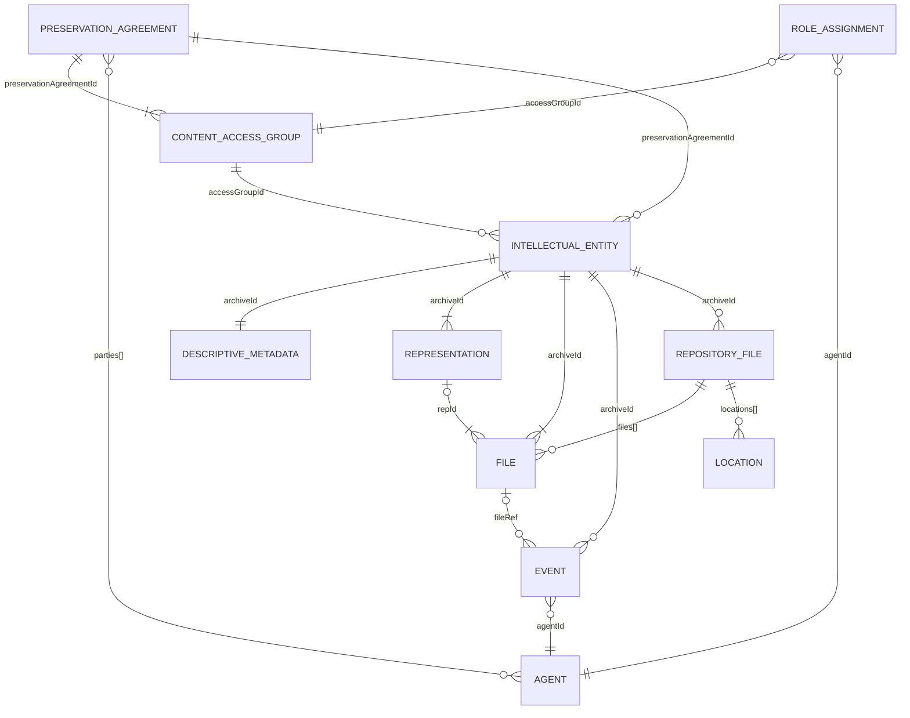

This page documents the data model of the DPS core: the metadata service and the bit repository. Together, these hold everything the DPS preserves and safeguards.

## DPS core

The DPS core consists of two components:

- **Metadata service**: databases and object storage that track everything about preserved content. Most services in the DPS read from or write to the metadata service.
- **Bit repository**: tape robots and disk libraries for safe long-term storage of the actual preserved data.

The surrounding services (API, ingest pipeline, dissemination pipeline) can be exchanged. The DPS core can also be replaced, but its contents would need to be migrated.



## Metadata service

The metadata service consists of four storage components.

### Preservation metadata database

A MongoDB database. The data model is based on PREMIS (Preservation Metadata: Implementation Strategies). It holds the following collections.

#### intellectualEntities

Each information package (AIP) is described as one Intellectual Entity document. The `_id` in this collection is called `archiveId`.

```json
{
  "_id": "019eb642-ab29-7cd3-9700-5b776ac6f572",
  "schemaVersion": 1,
  "accessGroupId": "2d17",
  "preservationAgreementId": "019f1234-abcd-7000-8000-000000000001",
  "objectId": "av_6e8bcasddd430-9c3a11d9",
  "sumSizeInBytes": 12345678987654321,
  "status": "preserved",
  "objectIdentifiers": [
    {
      "type": "URN",
      "value": "URN:NBN:no-nb_plfut_00001"
    }
  ],
  "contentCategory": "Photographs – Digital",
  "repositoryPrefix": "bilder",
  "CITS": "NB-METS-AUDIO-PROFILE-1.0",
  "createdDate": "2025-09-03T09:01:47.174Z",
  "lastModifiedDate": "2025-09-03T09:01:47.174Z",
  "version": 1
}
```

PREMIS mapping:

| Field                     | PREMIS semantic unit               | Notes                                                                             |
|---------------------------|------------------------------------|-----------------------------------------------------------------------------------|
| `archiveId`               | `objectIdentifier`                 | Internal DPS identifier. Type: `dps-archive-id`                                   |
| `objectId`                | `objectIdentifier`                 | Client-assigned, unique within content access group. Type: `dps-client-object-id` |
| `objectIdentifiers[]`     | `objectIdentifier`                 | Additional identifiers (URNs, external IDs)                                       |
| `accessGroupId`           | `linkingRightsStatementIdentifier` | Links to content access group                                                     |
| `preservationAgreementId` | `linkingRightsStatementIdentifier` | Links to preservation agreement (denormalized from CAG)                           |
| `status`                  | DPS extension                      | Workflow state                                                                    |
| `sumSizeInBytes`          | DPS extension                      | Aggregate size                                                                    |
| `contentCategory`         | DPS extension                      | Content classification                                                            |
| `repositoryPrefix`        | DPS extension                      | Storage namespace                                                                 |
| `CITS`                    | DPS extension                      | E-ARK content information type specification                                      |

`objectId` is stored as a flat string for operational reasons: it is a business key used throughout the API (submissions, webhooks, dissemination) and enforced as unique within a content access group. On PREMIS export it becomes a typed `objectIdentifier` with type `dps-client-object-id`, distinguishing it from internal DPS identifiers (`dps-archive-id`) and client-supplied typed identifiers in `objectIdentifiers[]` (URNs, DOIs, etc.).

> [!NOTE]
> **Two-layer rights on PREMIS export.** The IE carries a denormalized `preservationAgreementId` derived from its content access group. On PREMIS export, the IE produces two `linkingRightsStatementIdentifier` values: one for the content access group (`accessGroupId`) and one for the preservation agreement (`preservationAgreementId`). This gives PREMIS consumers the full two-layer rights picture without resolving intermediate documents, and enables agreement-level queries (e.g., "all IEs under this preservation agreement") without traversing the content access group collection. Both `accessGroupId` and `preservationAgreementId` are updated atomically when an IE moves between content access groups.

#### representations

Each IE contains at least one representation: the set of files needed to render the Intellectual Entity. The `_id` in this collection is called `repId`.

```json
{
  "_id": "019eafee-cb2f-7724-bb63-92a973d395bc",
  "schemaVersion": 1,
  "archiveId": "019eb642-ab29-7cd3-9700-5b776ac6f572",
  "representationName": "primary_20250325",
  "objectIdentifiers": [
    {
      "type": "URN",
      "value": "urn:roda:premis:representation:ca91729c-a8fc-35d8-be9a-97191114fcd3"
    }
  ],
  "relationships": [
    {
      "type": "structural",
      "subType": "is Part Of",
      "relatedObjectIdentifiers": [
        {
          "type": "URN",
          "value": "urn:roda:AIP:8ebdc91d-aa4d-4433-a33e-bcedc260a11f"
        }
      ]
    }
  ],
  "createdDate": "2025-09-03T09:01:47.174Z",
  "lastModifiedDate": "2025-09-03T09:01:47.174Z"
}
```

PREMIS mapping:

| Field                 | PREMIS semantic unit                 | Notes                                                  |
|-----------------------|--------------------------------------|--------------------------------------------------------|
| `repId`               | `objectIdentifier`                   | Internal DPS identifier. Type: `dps-representation-id` |
| `archiveId`           | Structural relationship to parent IE | Modeled as FK                                          |
| `representationName`  | `originalName`                       | Name of the representation directory                   |
| `objectIdentifiers[]` | `objectIdentifier`                   | Additional identifiers                                 |
| `relationships[]`     | `relationship`                       | Type + subType + relatedObjectIdentifiers              |

#### files

Files belonging to an IE. A file may sit inside a representation (content files) or at the package root (METS.xml, descriptive and preservation metadata, schemas, documentation). Format identification results and technical metadata references are stored here. The `_id` in this collection is called `fileId`.

```json
{
  "_id": "019e5265-91f6-7c9f-b738-dd0b937bb65a",
  "schemaVersion": 1,
  "archiveId": "019eb642-ab29-7cd3-9700-5b776ac6f572",
  "repId": "019eafee-cb2f-7724-bb63-92a973d395bc",
  "originalName": "iPRES2021_paper_38.pdf",
  "relativePath": "representations/primary_20250325/data/iPRES2021_paper_38.pdf",
  "size": 12041,
  "fileCreatedDate": "2025-07-31T10:04:20.772Z",
  "fixities": [
    {
      "algorithm": "MD5",
      "digest": "83f3af18b269075b6a87d2f6a758b706",
      "originator": "SIP"
    },
    {
      "algorithm": "SHA-1",
      "digest": "8838ae19801cd361d8054ec7bb82b2df4043c422",
      "originator": "DPS"
    },
    {
      "algorithm": "SHA-256",
      "digest": "1a8bbd231dd17586ec20e9988e9fbbff16d57bacaf8819f086f0ead4e73fb604",
      "originator": "DPS"
    }
  ],
  "format": {
    "mimeType": "application/pdf",
    "pronomId": "fmt/101",
    "formatName": "Portable Document Format",
    "formatVersion": "1.7",
    "formatNotes": [
      "SIEGFRIED WARNING: extension mismatch"
    ]
  },
  "techMetadataLocation": "s3://characterization-service-prod/clientId=nb-levende-bilder/contractId=91c5/submissionId=3DSyxDJoRPEqugBvNWHDc8/objectId=digifilm_248053_20130815_FT--42220185/fileId=019e5265-91ec-7adc-813b-0b7534e4cef6/extractor=mediainfo/runAt=2026-05-23T01-14-09.045Z/metadata.json/mediainfo_digifilm_248053_20130815_FT--42220185_batchPRE.mkv.json",
  "relationships": [
    {
      "type": "structural",
      "subType": "is Part Of",
      "relatedObjectIdentifiers": [
        {
          "type": "URN",
          "value": "representation:ca91729c-a8fc-35d8-be9a-97191114fcd3"
        }
      ]
    }
  ],
  "createdDate": "2025-09-03T09:01:47.174Z",
  "lastModifiedDate": "2025-09-03T09:01:47.174Z",
  "version": 1
}
```

`repId` is absent for files at the package root (METS.xml, metadata, schemas, documentation); these files relate directly to the IE via `archiveId`.

PREMIS mapping:

| Field                   | PREMIS semantic unit                                            | Notes                                                     |
|-------------------------|-----------------------------------------------------------------|-----------------------------------------------------------|
| `fileId`                | `objectIdentifier`                                              | Internal DPS identifier. Type: `dps-file-id`              |
| `archiveId`             | Relationship to IE                                              | FK; always present (every file belongs to exactly one IE) |
| `repId`                 | Relationship to representation                                  | FK; optional (only for files within a representation)     |
| `originalName`          | `originalName`                                                  | Direct match                                              |
| `relativePath`          | `storage.contentLocation.contentLocationValue`                  | Path within the package                                   |
| `size`                  | `objectCharacteristics.size`                                    | Direct match                                              |
| `fileCreatedDate`       | `creatingApplication.dateCreatedByApplication`                  |                                                           |
| `fixities[].algorithm`  | `objectCharacteristics.fixity.messageDigestAlgorithm`           | Direct match                                              |
| `fixities[].digest`     | `objectCharacteristics.fixity.messageDigest`                    | Direct match                                              |
| `fixities[].originator` | `objectCharacteristics.fixity.messageDigestOriginator`          | Direct match                                              |
| `format.formatName`     | `objectCharacteristics.format.formatDesignation.formatName`     | Direct match                                              |
| `format.formatVersion`  | `objectCharacteristics.format.formatDesignation.formatVersion`  | Direct match                                              |
| `format.pronomId`       | `objectCharacteristics.format.formatRegistry.formatRegistryKey` | `formatRegistryName=PRONOM` implied                       |
| `format.mimeType`       | `objectCharacteristics.format.formatRegistry.formatRegistryKey` | Can be exported with `formatRegistryName=IANA`            |
| `format.formatNotes[]`  | `objectCharacteristics.format.formatNote`                       | Direct match                                              |
| `techMetadataLocation`  | DPS extension                                                   | S3 path to extraction outputs                             |
| `relationships[]`       | `relationship`                                                  | Type + subType + relatedObjectIdentifiers                 |

#### events

PREMIS events, both client-submitted and DPS-generated. Every event is related to an IE and can optionally be attached to a specific file. The `_id` in this collection is called `eventId`.

```json
{
  "_id": "019e49af-a253-7ef0-b579-62050505db76",
  "schemaVersion": 1,
  "agentId": "019e3bcf-ca62-73eb-a698-9bad2e17eb7b",
  "archiveId": "019eb642-ab29-7cd3-9700-5b776ac6f572",
  "isUserInitiated": false,
  "fileRef": {
    "fileId": "019e5265-91f6-7c9f-b738-dd0b937bb65a",
    "relativePath": "metadata/descriptive/METS_digifilm_727480_20130730_FE--13281071_0003.xml"
  },
  "eventType": "ingest end",
  "eventDateTime": "2025-07-31T10:04:20.772Z",
  "eventDetail": "The ingest process has ended.",
  "outcome": "SUCCESS",
  "outcomeDetail": "The ingest process has successfully ended.",
  "createdDate": "2025-09-03T09:01:47.174Z",
  "lastModifiedDate": "2025-09-03T09:01:47.174Z"
}
```

PREMIS mapping:

| Field             | PREMIS semantic unit                                                | Notes                                                |
|-------------------|---------------------------------------------------------------------|------------------------------------------------------|
| `eventId`         | `eventIdentifier`                                                   |                                                      |
| `eventType`       | `eventType`                                                         | LoC preservation event vocabulary                    |
| `eventDateTime`   | `eventDateTime`                                                     | Direct match                                         |
| `eventDetail`     | `eventDetailInformation.eventDetail`                                |                                                      |
| `outcome`         | `eventOutcomeInformation.eventOutcome`                              |                                                      |
| `outcomeDetail`   | `eventOutcomeInformation.eventOutcomeDetail.eventOutcomeDetailNote` |                                                      |
| `agentId`         | `linkingAgentIdentifier`                                            | FK to agent                                          |
| `archiveId`       | `linkingObjectIdentifier`                                           | FK to IE                                             |
| `fileRef`         | `linkingObjectIdentifier`                                           | FK to file (optional)                                |
| `isUserInitiated` | DPS extension                                                       | Distinguishes client-submitted from system-generated |

#### agents

The people, organizations, software, or hardware that performed each event. The `_id` in this collection is called `agentId`.

Software agent (DPS tool):

```json
{
  "_id": "019e3bcf-ca62-73eb-a698-9bad2e17eb7b",
  "schemaVersion": 1,
  "agentName": "Configurable Ingest Plugin",
  "agentType": "software",
  "agentVersion": "1.2.3",
  "agentNote": "Performs all the tasks needed to ingest a SIP into the repository and therefore creating an AIP",
  "createdDate": "2025-09-03T09:01:47.174Z",
  "lastModifiedDate": "2025-09-03T09:01:47.174Z"
}
```

Client agent (API client, proposed):

```json {hl_lines=[6]}
{
  "_id": "019f1234-0000-7000-8000-cccccccccccc",
  "schemaVersion": 1,
  "agentName": "NRK Archive Ingest System",
  "agentType": "software",
  "clientId": "nb-dps-client-nrk-prod",
  "agentNote": "Production ingest client for NRK broadcast archive materials",
  "createdDate": "2025-09-03T09:01:47.174Z",
  "lastModifiedDate": "2025-09-03T09:01:47.174Z",
  "version": 1
}
```

Organization agent (agreement signatory, proposed):

```json
{
  "_id": "019f1234-0000-7000-8000-aaaaaaaaaaaa",
  "schemaVersion": 1,
  "agentName": "NRK",
  "agentType": "organization",
  "agentNote": "Norwegian Broadcasting Corporation",
  "createdDate": "2025-09-03T09:01:47.174Z",
  "lastModifiedDate": "2025-09-03T09:01:47.174Z",
  "version": 1
}
```

The following field is proposed for the existing agents collection:

| Field      | Description                                                                                                                                       | Required |
|------------|---------------------------------------------------------------------------------------------------------------------------------------------------|----------|
| `clientId` | Keycloak client identifier for IAM sync. Present only on API client agents. Must be unique across all agents; enforced by a unique partial index. | No       |

> [!NOTE]
> **Possible expansion: agentIdentifiers.** An `agentIdentifiers[]` array (type + value pairs) could be added for general-purpose identifiers such as organization numbers, URNs, or references to external registries. This would align with the PREMIS `agentIdentifier` semantic unit, which supports multiple identifiers per agent.
>
> ```json
> {
>   "agentIdentifiers": [
>     { "type": "orgId", "value": "992029188" }
>   ]
> }
> ```

PREMIS mapping:

| Field          | PREMIS semantic unit | Notes                                                    |
|----------------|----------------------|----------------------------------------------------------|
| `agentId`      | `agentIdentifier`    |                                                          |
| `agentName`    | `agentName`          | Direct match                                             |
| `agentType`    | `agentType`          | person, organization, software, hardware                 |
| `agentVersion` | `agentVersion`       | Added in PREMIS 3.0                                      |
| `agentNote`    | `agentNote`          | Direct match                                             |
| `clientId`     | DPS extension        | IAM link to Keycloak. Present only on API client agents. |

#### preservationAgreements (proposed)

Each preservation agreement represents the organizational relationship between the National Library and a client organization. Logically a PREMIS Rights entity. The `rightsBasis` is stored per agreement (`other`/`license`/`statute`); the common case is `other` (contractual deposit). PREMIS structural fields are reconstructed during export. The `_id` in this collection is called `preservationAgreementId`. For the full design rationale, see [Agreement model](/docs/dps/agreements/).

```json
{
  "_id": "019f1234-abcd-7000-8000-000000000001",
  "schemaVersion": 1,
  "rightsBasis": "other",
  "name": "Bevaringsavtale NRK",
  "identifiers": [
    {
      "type": "archiveRef",
      "value": "DOK-2024-00142"
    }
  ],
  "rightsInformation": {
    "terms": "Avtale om sikring og bevaring av NRKs digitale kringkastingsarkiv. Omfatter digitalisert og digitalt født audio- og videomateriale fra NRKs kringkastingsarkiv.",
    "startDate": "2024-01-15",
    "endDate": null
  },
  "documents": [
    {
      "type": "signedContract",
      "description": "Avtale om sikring og bevaring av NRKs digitale kringkastingsarkiv",
      "date": "2024-01-15",
      "files": [
        {
          "s3Path": "s3://dps-agreements/019f1234-abcd-7000-8000-000000000001/avtale-2024.pdf",
          "dateStored": "2024-01-16T10:00:00.000Z"
        },
        {
          "s3Path": "s3://dps-agreements/019f1234-abcd-7000-8000-000000000001/vedlegg-1.pdf",
          "dateStored": "2024-01-16T10:00:00.000Z"
        }
      ]
    }
  ],
  "parties": [
    {
      "agentId": "019f1234-0000-7000-8000-aaaaaaaaaaaa",
      "role": "depositor"
    },
    {
      "agentId": "019f1234-0000-7000-8000-bbbbbbbbbbbb",
      "role": "custodian"
    }
  ],
  "createdDate": "2025-09-03T09:01:47.174Z",
  "lastModifiedDate": "2025-09-03T09:01:47.174Z",
  "version": 1
}
```

`rightsInformation.terms` should describe both the agreement's purpose and its scope.

| Field                            | Description                                                                                                          | Required      |
|----------------------------------|----------------------------------------------------------------------------------------------------------------------|---------------|
| `_id` (preservationAgreementId)  | Internal DPS identifier (UUIDv7)                                                                                     | Yes           |
| `schemaVersion`                  | Document schema version                                                                                              | Yes           |
| `rightsBasis`                    | Rights basis: `other` (contractual deposit, default), `license`, or `statute`. Determines the PREMIS export mapping. | Yes           |
| `name`                           | Human-readable title for the agreement                                                                               | Yes           |
| `identifiers[].type`             | Type of external reference (e.g., `archiveRef`, `agreementRef`)                                                      | Yes per entry |
| `identifiers[].value`            | Reference value in the external system                                                                               | Yes per entry |
| `rightsInformation.terms`        | Description of the agreement's purpose and scope                                                                     | Yes           |
| `rightsInformation.startDate`    | Date the agreement took effect                                                                                       | Yes           |
| `rightsInformation.endDate`      | Date the agreement ended; null if active                                                                             | No            |
| `documents[].type`               | Document category: `signedContract`, `amendment`, `appendix`                                                         | Yes per entry |
| `documents[].description`        | Human-readable description of the document                                                                           | No            |
| `documents[].date`               | Date of the document                                                                                                 | Yes per entry |
| `documents[].files[].s3Path`     | S3 storage path                                                                                                      | Yes per file  |
| `documents[].files[].dateStored` | When the file was stored in S3                                                                                       | Yes per file  |
| `parties[].agentId`              | FK to agent                                                                                                          | Yes per entry |
| `parties[].role`                 | Role in the agreement: `depositor`, `custodian` (for `rightsBasis=other`). May vary by basis.                        | Yes per entry |
| `createdDate`                    | Document creation timestamp                                                                                          | Yes           |
| `lastModifiedDate`               | Last modification timestamp                                                                                          | Yes           |
| `version`                        | Optimistic locking version                                                                                           | Yes           |

> [!NOTE]
> **Possible expansion: status field.** A `status` field (active/suspended/terminated) could be added if the DPS needs to temporarily suspend a preservation agreement without closing it. Without status, the lifecycle is binary: `endDate: null` means active, `endDate` set means closed.

> [!NOTE]
> **Agreement mutation and history.** Agreements mutate in place: `version` and `lastModifiedDate` track the latest modification but do not preserve prior state. The `documents[]` array is append-only (amendments are added, not edited), providing a partial audit trail of legal documents. However, `rightsInformation.terms` may be updated in place to reflect the current state, and prior terms are lost. The external archive system is the authoritative source for signed documents and their history. If full mutation history is needed, an `agreementHistory` collection or the generic `auditLog` collection proposed in [Role assignments](/docs/dps/agreements/#role-assignments) could preserve the agreement's evolution.

> [!NOTE]
> **Possible expansion: preservation-level `rightsGranted`.** The preservation agreement could carry `rightsGranted` entries for preservation-level rights: what the NLN may do with the content over time (migration, replication, deletion, normalization, validation, refreshment). These rights are distinct from the content access group's functional rights (submit, access), which are decomposed into role assignments. Preservation-level rights matter for long-term preservation policy and PREMIS fidelity, but are not enforced by the DPS at runtime in the same way. The `act` values draw from the full [LoC eventType vocabulary](https://id.loc.gov/vocabulary/preservation/eventType).

> [!NOTE]
> **Possible expansion: enforceable scope.** The preservation agreement could carry machine-readable constraints that the ingest pipeline validates against. This would address the gap documented in [Data management](/docs/dps/data/): "We cannot currently validate automatically at the object level against what is stated in the submission agreement."
>
> Example constraints:
>
> ```json
> {
>   "constraints": {
>     "allowedTypes": ["Film", "Fjernsyn", "Dokumentasjonslyd"],
>     "allowedFormats": [
>       { "mimeType": "video/x-matroska" },
>       { "pronomId": "fmt/569" }
>     ],
>     "maxFileSizeInBytes": 107374182400,
>     "expectedTotalVolumeInBytes": 53687091200000,
>     "expectedPackageCount": 50000
>   }
> }
> ```
>
> - **allowedTypes**: Dublin Core `type` values permitted under this agreement. Validated at submission creation against the controlled vocabulary.
> - **allowedFormats**: accepted file formats as MIME types or PRONOM identifiers. Validated after format identification during ingest.
> - **maxFileSizeInBytes**: per-file size limit. Validated at file registration.
> - **expectedTotalVolumeInBytes**: anticipated cumulative data volume for capacity planning and anomaly detection.
> - **expectedPackageCount**: anticipated number of packages for monitoring.
>
> Whether violations result in soft warnings or hard rejections is an open question.

PREMIS mapping:

| Field                     | PREMIS semantic unit                    | Notes                                                                                                                                                                                           |
|---------------------------|-----------------------------------------|-------------------------------------------------------------------------------------------------------------------------------------------------------------------------------------------------|
| `preservationAgreementId` | `rightsStatementIdentifier`             |                                                                                                                                                                                                 |
| `rightsBasis`             | `rightsBasis`                           | Stored field; was implicit before                                                                                                                                                               |
| `identifiers[]`           | Basis-specific documentation identifier | `other`→`otherRightsDocumentationIdentifier`, `license`→`licenseDocumentationIdentifier`. Same `{type, value}` pattern as `objectIdentifiers` on IEs.                                           |
| `rightsInformation`       | Basis-specific rights information block | `other`→`otherRightsInformation` (with `otherBasis=preservationAgreement`), `license`→`licenseInformation`, `statute`→`statuteInformation`. Reconstructed from `terms` + `startDate`/`endDate`. |
| `documents[]`             | DPS extension                           | S3-stored copies of signed agreement files, grouped by logical document. The external archive system is the authoritative source.                                                               |
| `parties[]`               | `linkingAgentIdentifier`                | With `linkingAgentRole` (depositor/custodian; DPS extension, not in LC vocabulary)                                                                                                              |

#### contentAccessGroups (proposed)

Each content access group is a functional entity controlling access to a set of IEs. Logically a PREMIS Rights entity; PREMIS structural fields (`rightsBasis`, `otherRightsInformation`) are omitted from the document and reconstructed during export. The `_id` in this collection is the `accessGroupId` (4-character hex). The `preservationAgreementId` linking to the parent preservation agreement is immutable.

```json
{
  "_id": "4eaf",
  "schemaVersion": 1,
  "preservationAgreementId": "019f1234-abcd-7000-8000-000000000001",
  "name": "NRK Broadcast Archive - Video",
  "description": "Digitized and born-digital broadcast video",
  "startDate": "2024-02-01",
  "endDate": null,
  "createdDate": "2025-09-03T09:01:47.174Z",
  "lastModifiedDate": "2025-09-03T09:01:47.174Z",
  "version": 1
}
```

| Field                     | Description                                                    | Required |
|---------------------------|----------------------------------------------------------------|----------|
| `_id` (accessGroupId)     | 4-character hex identifier                                     | Yes      |
| `schemaVersion`           | Document schema version                                        | Yes      |
| `preservationAgreementId` | FK to parent preservation agreement (immutable after creation) | Yes      |
| `name`                    | Human-readable label                                           | Yes      |
| `description`             | Description of what content is covered                         | Yes      |
| `startDate`               | Date the content access group took effect                      | Yes      |
| `endDate`                 | Date it ended; null if active                                  | No       |
| `createdDate`             | Document creation timestamp                                    | Yes      |
| `lastModifiedDate`        | Last modification timestamp                                    | Yes      |
| `version`                 | Optimistic locking version                                     | Yes      |

> [!NOTE]
> **Possible expansion: status field.** A `status` field (active/suspended/closed) could be added if the DPS needs to temporarily suspend a content access group without closing it. Without status, the lifecycle is binary: `endDate: null` means active, `endDate` set means closed. Suspension would require a state beyond what dates alone can express.

PREMIS mapping:

| Field                     | PREMIS semantic unit         | Notes                                           |
|---------------------------|------------------------------|-------------------------------------------------|
| `accessGroupId`           | `rightsStatementIdentifier`  | 4-char hex                                      |
| `preservationAgreementId` | DPS extension                | FK to parent preservation agreement (immutable) |
| `name`, `description`     | DPS extensions               | Operational metadata                            |
| `startDate`, `endDate`    | `otherRightsApplicableDates` | Reconstructed as PREMIS structure during export |

`rightsGranted` is not stored on the content access group document. On PREMIS export, active role assignments are collected and reconstructed as `rightsGranted` entries: `role` → `act` (eventType vocabulary, replacing deprecated `actionsGranted`), `startDate`/`endDate` → `termOfGrant`, `agentId` → `linkingAgentIdentifier`.

#### roleAssignments (proposed)

Each role assignment links an agent to a content access group with a specific role. Stored as a separate collection from content access groups so that role changes do not modify the content access group document. The core assignment fields are immutable after creation; only `endDate` is set, once, to revoke.

```json
{
  "_id": "019f5678-0001-7000-8000-000000000001",
  "schemaVersion": 1,
  "accessGroupId": "4eaf",
  "agentId": "019f1234-0000-7000-8000-cccccccccccc",
  "role": "producer",
  "startDate": "2024-02-01",
  "endDate": null,
  "createdDate": "2024-02-01T10:00:00.000Z",
  "lastModifiedDate": "2024-02-01T10:00:00.000Z"
}
```

A revoked role (endDate set once, document never deleted):

```json
{
  "_id": "019f5678-0002-7000-8000-000000000002",
  "schemaVersion": 1,
  "accessGroupId": "4eaf",
  "agentId": "019f1234-0000-7000-8000-dddddddddddd",
  "role": "consumer",
  "startDate": "2025-03-15",
  "endDate": "2026-01-01",
  "createdDate": "2025-03-15T10:00:00.000Z",
  "lastModifiedDate": "2026-01-01T09:00:00.000Z"
}
```

| Field                    | Description                                                                            | Required |
|--------------------------|----------------------------------------------------------------------------------------|----------|
| `_id` (roleAssignmentId) | Internal DPS identifier (UUIDv7)                                                       | Yes      |
| `schemaVersion`          | Document schema version                                                                | Yes      |
| `accessGroupId`          | FK to content access group                                                             | Yes      |
| `agentId`                | FK to agent                                                                            | Yes      |
| `role`                   | `producer` or `consumer`                                                               | Yes      |
| `startDate`              | Date the role was granted                                                              | Yes      |
| `endDate`                | Date the role was revoked; null if active. Write-once: once set, it cannot be changed. | No       |
| `createdDate`            | Document creation timestamp                                                            | Yes      |
| `lastModifiedDate`       | Last modification timestamp                                                            | Yes      |

`version` (optimistic locking) is intentionally omitted: the only mutation is the one-time `endDate` set, guarded by a conditional update on `endDate: null`.

PREMIS mapping:

| Field                  | PREMIS semantic unit                      | Notes                                                                                       |
|------------------------|-------------------------------------------|---------------------------------------------------------------------------------------------|
| `accessGroupId`        | Reference to `rightsStatement`            | FK to content access group                                                                  |
| `agentId`              | `linkingAgentIdentifier`                  | FK to agent                                                                                 |
| `role`                 | `linkingAgentRole`                        | producer or consumer; also maps to `rightsGranted.act` on CAG export (eventType vocabulary) |
| `startDate`, `endDate` | `rightsGranted.termOfGrant` on CAG export | Also DPS audit trail                                                                        |

### Descriptive metadata database

A MongoDB database. Each IE is linked to exactly one Dublin Core document. This is the metadata submitted through the Submission API, stored separately from the preservation metadata but connected to the same IEs.

#### descriptiveMetadata

Dublin Core metadata for discovery. The `_id` in this collection is called `descId`.

```json
{
  "_id": "019e4fd5-99d4-79e3-8503-ab4ae7a513f0",
  "schemaVersion": 1,
  "archiveId": "019eb642-ab29-7cd3-9700-5b776ac6f572",
  "type": "Bilde",
  "identifier": [
    {
      "type": "URN",
      "value": "URN:NBN:no-nb_digifoto_20220311_00191_NB_PE_VM_M_05_09_01_036"
    }
  ],
  "title": {
    "value": "Ola og Kari på fisketur i Rondane",
    "lang": "nor"
  },
  "alternative": [
    {
      "type": "originaltittel",
      "value": "Ola and Kari on fishing trip in Rondane",
      "lang": "eng"
    }
  ],
  "creator": [
    {
      "name": "Marek, Václav",
      "type": "person",
      "role": "fotograf",
      "authority": {
        "source": "Felles autoritetsregister (BARE)",
        "code": "90362181",
        "uri": "https://bibsys-almaprimo.hosted.exlibrisgroup.com/permalink/f/nelpa2/AUTREG90362181"
      }
    }
  ],
  "contributor": [
    {
      "name": "Nordmann, Ola",
      "type": "person",
      "role": "avbildet",
      "authority": {
        "source": "Felles autoritetsregister (BARE)",
        "code": "90362181",
        "uri": "https://bibsys-almaprimo.hosted.exlibrisgroup.com/permalink/f/nelpa2/AUTREG90362181"
      }
    }
  ],
  "publisher": [
    {
      "name": "Nasjonalbiblioteket",
      "type": "Korporasjon",
      "authority": {
        "source": "Felles autoritetsregister (BARE)",
        "code": "90362181",
        "uri": "https://bibsys-almaprimo.hosted.exlibrisgroup.com/permalink/f/nelpa2/AUTREG90362181"
      }
    }
  ],
  "spatial": [
    {
      "name": "Norge (NO);Innlandet;Stor-Elvdal;Rondane gjestegård",
      "type": "Avbildet sted",
      "authority": {
        "source": "Felles autoritetsregister (BARE)",
        "code": "90362181",
        "uri": "https://bibsys-almaprimo.hosted.exlibrisgroup.com/permalink/f/nelpa2/AUTREG90362181"
      },
      "coordinateReferenceSystem": "EPSG:4326",
      "latitude": 61.788453,
      "longitude": 10.224725
    }
  ],
  "date": [
    {
      "type": "digitalisert",
      "value": "2022-03-05T14:28:12+02:00"
    }
  ],
  "language": [
    {
      "type": "undertekster",
      "value": "nor"
    }
  ],
  "relation": [
    {
      "title": "Norge på langs med Ola og Kari",
      "type": "IsPartOf",
      "id": "987654321",
      "uri": "https://www.nb.no/items/eb57e3c314894b0120cf631104065e74?page",
      "lang": "nor"
    }
  ],
  "provenance": [
    {
      "value": "Bildet er del av en digital samling, som ble donert til Nasjonalbiblioteket av Ola Nordmann 2025-01-01.",
      "lang": "nor"
    }
  ],
  "source": [
    {
      "description": "Hjelp vi flyr, U-matic HB videobånd",
      "identifier": [
        {
          "type": "URN",
          "value": "URN:NBN:no-nb_digifoto_20220311_00191_NB_PE_VM_M_05_09_01_036"
        }
      ],
      "uri": "https://collections.nb.no/collections/link/xplus/audiovisualcatalogue/50979618"
    }
  ],
  "subject": [
    {
      "value": "rondane",
      "authority": {
        "source": "Felles autoritetsregister (BARE)",
        "code": "90362181",
        "uri": "https://bibsys-almaprimo.hosted.exlibrisgroup.com/permalink/f/nelpa2/AUTREG90362181"
      }
    }
  ],
  "description": [
    {
      "value": "Bildet er en del av samlingen etter Václav Marek, der han fulgte Ola og Kari Nordmann Norge på langs. Václav Marek var en engelskmann som var interessert i Norge og norsk natur.",
      "lang": "nob"
    }
  ]
}
```

### Location database

A MongoDB database. The DPS repackages and reorganizes files submitted in SIPs for better utilization of the bit repository. This database tracks where files are physically stored.

#### repositoryFiles

Each repository file document is linked to an IE and the file documents it contains. The `_id` in this collection is called `repositoryFileId`.

```json
{
  "_id": "019e4a63-2e5c-711d-90fc-6d259ca94226",
  "schemaVersion": 1,
  "archiveId": "019eb642-ab29-7cd3-9700-5b776ac6f572",
  "isContainer": true,
  "relativePath": "metadata.tar",
  "size": 12041,
  "fileCreatedDate": "2025-07-31T10:04:20.772Z",
  "fixities": [
    {
      "algorithm": "MD5",
      "digest": "83f3af18b269075b6a87d2f6a758b706",
      "originator": "SIP"
    },
    {
      "algorithm": "SHA-1",
      "digest": "8838ae19801cd361d8054ec7bb82b2df4043c422",
      "originator": "DPS"
    }
  ],
  "files": [
    {
      "fileId": "019e5265-92e6-75d6-ae8f-a7c740605ea7",
      "relativePath": "representations/primary_20250325/data/iPRES2021_paper_38.pdf"
    },
    {
      "fileId": "019e5265-9305-75c6-a456-9ef0f062716f",
      "relativePath": "METS.xml"
    }
  ],
  "locations": [
    {
      "locationId": "hpss",
      "filePath": "/bilder/f28/740/6df/68b803fb25d74833747835f7/metadata.tar",
      "dateStored": "2025-09-02T21:18:16.562Z",
      "fixityStatus": "VALIDATED",
      "dateFixityStatus": "2025-09-02T21:20:30.928Z"
    },
    {
      "locationId": "s3",
      "filePath": "s3://preservation-bucket/bilder/f28/740/6df/68b803fb25d74833747835f7/metadata.tar",
      "dateStored": "2025-09-02T21:18:16.562Z",
      "fixityStatus": "VALIDATED",
      "dateFixityStatus": "2025-09-02T21:20:30.928Z"
    }
  ],
  "createdDate": "2025-09-03T09:01:47.174Z",
  "lastModifiedDate": "2025-09-03T09:01:47.174Z",
  "version": 1
}
```

The `files[]` array is the TAR manifest: it lists the logical files (from the `files` collection) that are packed into this repository file. For unpacked repository files (`isContainer: false`), this array is empty and the repository file corresponds directly to a single logical file.

Each `locations[]` entry represents one physical copy in the bit repository. Multiple locations implement the 3-2-1 storage policy.

PREMIS mapping:

| Field                    | PREMIS semantic unit                           | Notes                                                   |
|--------------------------|------------------------------------------------|---------------------------------------------------------|
| `repositoryFileId`       | `objectIdentifier`                             | Internal DPS identifier. Type: `dps-repository-file-id` |
| `archiveId`              | Relationship to IE                             | FK                                                      |
| `relativePath`           | `storage.contentLocation.contentLocationValue` | Path of the repository file                             |
| `size`                   | `objectCharacteristics.size`                   | Direct match                                            |
| `fixities[]`             | `objectCharacteristics.fixity`                 | Direct match                                            |
| `locations[].locationId` | `storage.storageMedium`                        | e.g., `hpss`, `s3`                                      |
| `locations[].filePath`   | `storage.contentLocation.contentLocationValue` | Physical path in storage                                |
| `files[]`                | `relationship` (structural, "includes")        | References to contained logical files                   |
| `isContainer`            | Implied by presence of `files[]` relationships |                                                         |

### Object storage

Extracted technical metadata produced by MediaInfo and ExifTool during ingest is stored as files in an S3 object storage bucket. File documents in the preservation metadata database reference these outputs via the `techMetadataLocation` field.

## Bit repository

The bit repository is the physical storage infrastructure that holds the actual preserved data. It consists of 2 tape libraries and a disk library, providing redundant storage across different media types and geographic locations.

The bit repository is not a database. Its contents are tracked by the `repositoryFiles` collection in the location database. The relationship chain from logical content to physical storage is:


- **files** describe the content as submitted in the SIP
- **repositoryFiles** describe how that content is physically stored, possibly packed into TAR containers for storage efficiency
- **locations** within each repository file describe where each physical copy sits in the bit repository
- The **bit repository** holds the actual bytes, protected by the 3-2-1 storage policy: three copies, on two different storage technologies, with one copy stored off-site


