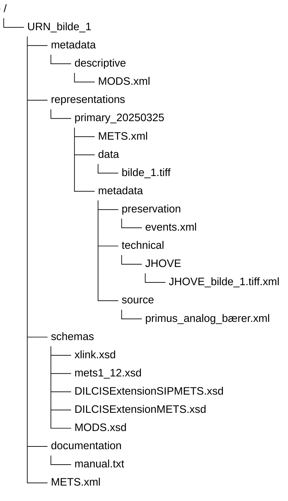

## Eksempel på SIP for bilder

```mermaid
---
config:
    treeView:
        rowIndent: 30
---
treeView-beta
    "URN_bilde_1"
        "metadata"
            "descriptive"
                "MODS.xml"
        "representations"
            "primary_20250325"
                "METS.xml"
                "data"
                    "bilde_1.tiff"
                "metadata"
                    "preservation"
                        "events.xml"
                    "technical"
                        "JHOVE"
                            "JHOVE_bilde_1.tiff.xml"
                    "source"
                        "primus_analog_bærer.xml"
        "schemas"
            "xlink.xsd"
            "mets1_12.xsd"
            "DILCISExtensionSIPMETS.xsd"
            "DILCISExtensionMETS.xsd"
            "MODS.xsd"
        "documentation"
            "manual.txt"
        "METS.xml"
```

## Eksempel på SIP for bilder



---