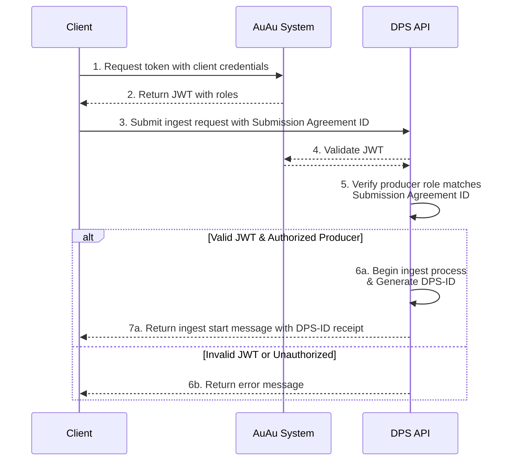
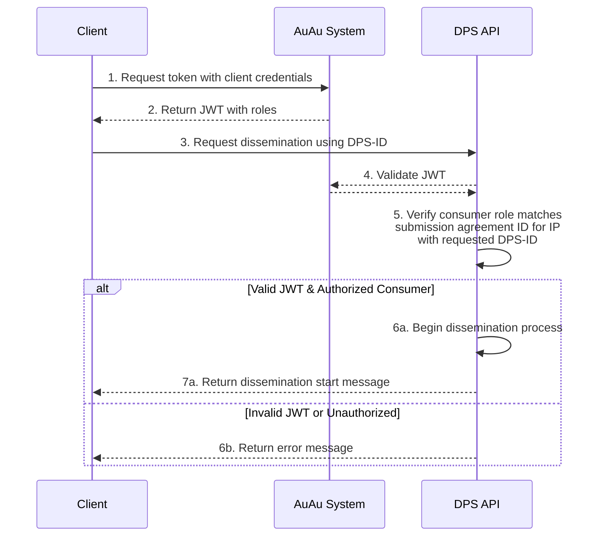
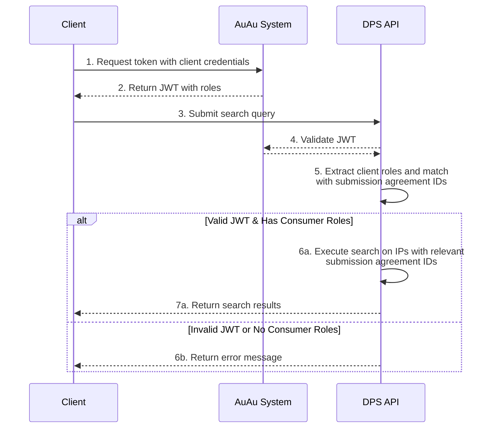

The model governing access to submit data to or retrieve data from DPS has four main components: *clients*, *roles*, *preservation agreements*, and *information packages*.

### Clients
All users who need to communicate with the DPS will be given a client (with a clientID) by the National Library.
All clients can be assigned multiple roles.

### Roles
The roles come in two variants: *producer* and *consumer*.

A producer role gives the client rights to *submit* data to the DPS in the form of information packages, while a consumer role provides access to *retrieve* data in the form of information packages from the DPS.
Without a role the client cannot interact with the DPS

All individual roles are in turn linked to specific submission agreements. 
Roles are assigned to clients by the National Library, in accordance to the terms of the submission agreement.

### Submission agreement
Submission agreements define how a given information package should be managed.
Submission agreements are created between producers (OAIS) and the National Library.
The term originates from OAIS and are also summarized in the E-ARK-SIP specifications[^1] as follows:

> Interactions between Producers and the OAIS are often guided by a Submission Agreement, which establishes specific details about how these interactions should take place, e.g. the type of information expected to be exchanged, the metadata the Producer is expected to deliver, the logistics of the actual transfer, statements regarding access restrictions on the submitted material, etc.

In the context of role-based access, it is not the details of these submission agreements that are important, but rather that the submission agreements are established in our systems.

Producer/consumer roles related to the submission agreements are created in our authorization system.
A preservation agreement must exist *before* the submission of information packages to DPS can occur.

Submission agreements are linked to one or more information packages.

### Information Packages
When data or metadata is to be submitted to or retrieved from DPS, this is done in the form of information packages.
Individual information packages are linked to one (and only one) submission agreement.

### DPS-ID
The DPS generates a DPS-ID for all information packages received.
The DPS-ID is unique within our systems.
The DPS-ID is issued as a receipt to the party who delivered the information package at the time of delivery.



### Example: Submit information packages
A client submitting an information package to the DPS must specify which submission agreement should apply to the package.
One can only submit information packages linked to submission agreements one is authorized to *produce*.
If one has the correct roles, the DPS will initiate the ingest process, mint a DPS-ID for the information package, send the DPS-ID as receipt to the client.

### Example: Request information packages
A client wishing to retrieve this information package must specify which package to retrieve using the package's DPS-ID.
If the client has a consumer role linked to the preservation agreement governing the relevant information package, the DPS will initiate the dissemination process.

### Example: Search for information packages
A client wishing to search for contents managed by the DPS, will be able to search all information packages connected to the preservation agreements for which they have a consumer role.

[^1]: [E-ARK SIP: 4.1. Submission Agreements](https://earksip.dilcis.eu/#submissionagreements)